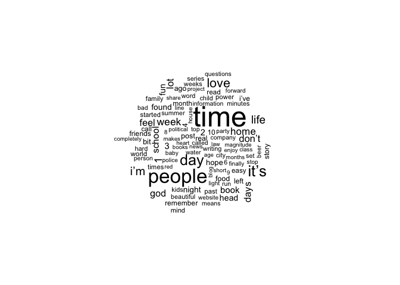
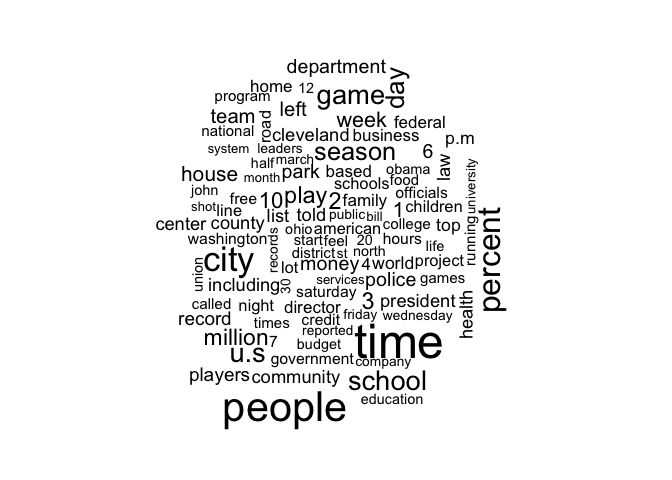
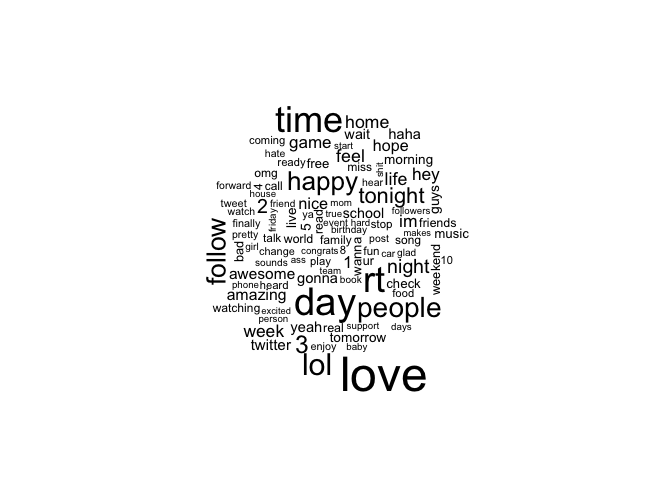
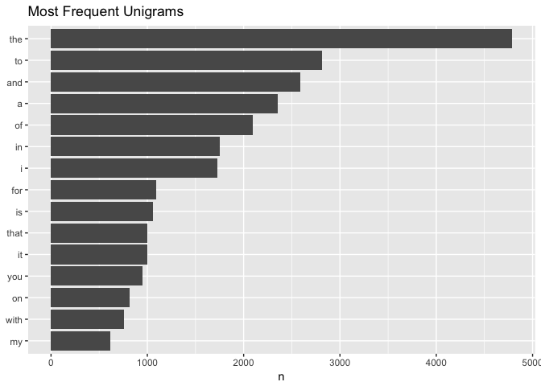
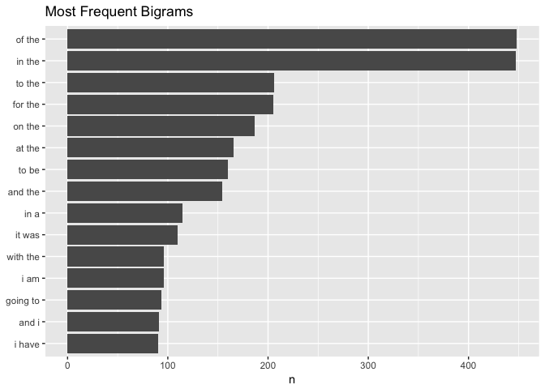
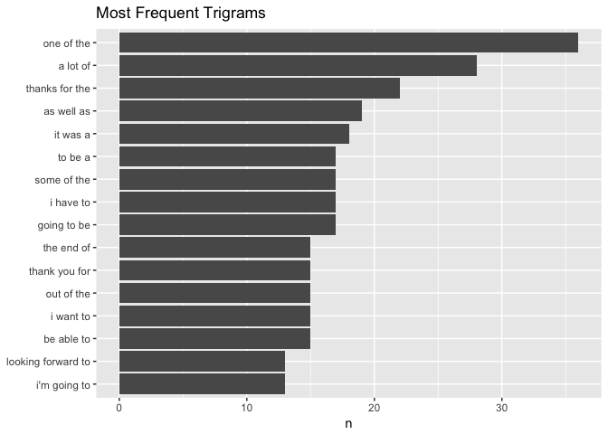
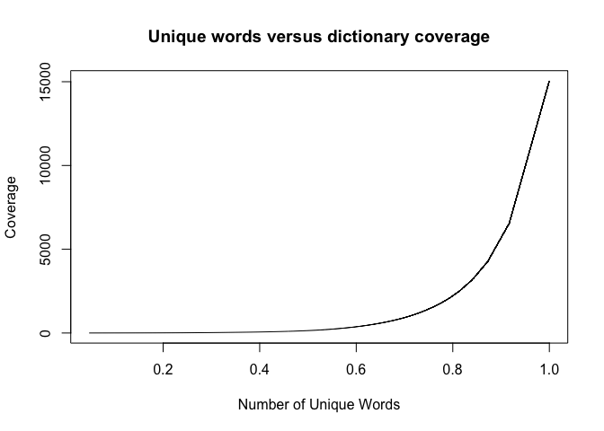

# Data Science Capstone: Milestone Report
Sean Angiolillo  
6 February 2018  


## Introduction

This is my milestone report in support of the JHU Data Science Specialization Capstone on Coursera. My goal is to make a preliminary exploration of the data and lay out a plan to construct a prediction algorithm in the eventual Shiny app.

## Load Libraries and Data


First I'll download the data and calculate the size of each file. I'm choosing only to work with the English language texts.


```
##                                 file_size_MB
## ./final/en_US/en_US.blogs.txt       200.4242
## ./final/en_US/en_US.news.txt        196.2775
## ./final/en_US/en_US.twitter.txt     159.3641
```

We can see these are large files. I tried data.table's `fread` function and stringi's `stri_read_lines` but they had trouble with null strings in the tweets file. The base `readLines` worked fine, but `read_lines` of the tidyverse was faster.


Stringi's `stri_stats_general` is a useful function to get the number of lines and characters in each corpus. We can see that we don't have any empty lines.


```
##                 blogs      news    tweets
## Lines          899288   1010242   2360148
## LinesNEmpty    899288   1010242   2360148
## Chars       206824382 203223154 162096031
## CharsNWhite 170389539 169860866 134082634
```

## Sample Data

Because we are just exploring the data for cleaning and preliminary visualizations, we can take small samples of each file in order to make our computations run faster and view the first two elements of each.


```
## Saturday evening entailed a leisurely dinner at Ten, a Japanese restaurant, with a bit of a hip, modern ambiance. They have a full liquor menu, including a list of about twenty different sakes, including some very good selections. The food menu is diverse, and a bit pricey, though the quality and quantity are high, and provide justification for those prices. Their Nigiri Sushi is sold by the single piece, often priced at $4-$6, which is the same at in most high-end sushi places. But, the slices of fish, which seemed quite fresh, were very large, often making it necessary to eat the sushi in two bites rather than one. So, you could end up with more fish on one piece than you might find in two pieces elsewhere.
## You certainly have to leave home (or your hotel room) to get to the best beer shops in Belgium. One of the best is undoubtedly Bierhandel Willems in Grobbendonk, a village in the Antwerpen province and a 40-minute bus ride from the Sinjorenstad itself. Willems en zoon stocks 300 different beers, and among them are quite a few rarities, including the three on the picture.
```

```
## And by "it," she doesn't mean the language.
## "We were beaten in every phase of the game," Hawks coach Larry Drew said. "We just didn't respond very well. I haven't seen that type of performance in our team in quite some time."
```

```
## Ended up staying in an SRO where I sit as I type this. A little expensive, but I have a private space.
## Do you know where Jr going in life? If u don't have a plan. You plan 2 fail! Wat is ur plan?
```

In addition to reading a few examples, we can compute a few summary statistics for each file. We have more tweets than blogs or news excerpts, but not surprisingly the tweets are much shorter.


```
##     file lines max_word mean_word sum_word
## 1  blogs   899      430  42.85651    38528
## 2   news  1010      177  35.06931    35420
## 3 tweets  2360       31  12.85551    30339
```


## Choosing Texts

I had to determine which files to use for the project. I was somewhat reluctant to use the tweets because the language it contains would need more cleaning and have more slang and misspellings that would be difficult to correct. I created wordclouds of each to get a sense of the kinds of words each file contained. Because they appear to constitute largely different vocabulary, I'll combine the three samples into one corpus in order to increase language coverage. 


```
## Joining, by = "word"
```

<!-- -->

```
## Joining, by = "word"
```

<!-- -->

```
## Joining, by = "word"
```

<!-- -->

## Remove Foreign Characters

One of my first cleaning steps is to remove all foreign characters from the sample. We chose the English files to begin with but we can see that some foreign characters do remain.


```
##   [1] "S"          "a"          "t"          "u"          "r"         
##   [6] "d"          "y"          " "          "e"          "v"         
##  [11] "n"          "i"          "g"          "l"          "s"         
##  [16] "T"          ","          "J"          "p"          "w"         
##  [21] "h"          "b"          "o"          "f"          "m"         
##  [26] "c"          "."          "q"          "k"          "j"         
##  [31] "N"          "$"          "4"          "-"          "6"         
##  [36] "B"          "Y"          "("          ")"          "O"         
##  [41] "W"          "G"          "A"          "0"          "z"         
##  [46] "3"          ":"          "x"          "M"          "’"         
##  [51] "8"          ";"          "D"          "!"          "I"         
##  [56] "E"          "1"          "5"          "V"          "C"         
##  [61] "'"          "“"          "”"          "2"          "P"         
##  [66] "H"          "R"          "?"          "="          "L"         
##  [71] "U"          "–"          "\""         "…"          "F"         
##  [76] "9"          "é"          "‘"          "/"          "K"         
##  [81] "7"          "—"          "@"          "*"          "♥"         
##  [86] "~"          "ä"          "&"          "ñ"          "Q"         
##  [91] "Z"          "%"          "′"          "á"          "X"         
##  [96] "#"          "+"          "£"          "«"          "»"         
## [101] "â"          "°"          "ó"          "["          "]"         
## [106] "|"          ""           "ø"          "\u0092"     "\u0096"    
## [111] "\u0095"     "\u0093"     "\u0094"     "\u0097"     "​"          
## [116] "♠"          "♦"          "♣"          "Â"          "_"         
## [121] "<"          ">"          "\U0001f625" "☺"          "♪"         
## [126] "♫"          "\U0001f60d" "\U0001f602" "\U0001f616" "➡"         
## [131] "\U0001f499" "\U0001f60f" "\U0001f61c" "\U0001f618" "\U0001f3a7"
## [136] "\U0001f44d" "\U0001f61a" "\U0001f603" "\U0001f628" ""         
## [141] "\\"         "\U0001f614" "❤"          "^"          "\U0001f609"
## [146] "`"          "\U0001f62d" "\U0001f457" "\U0001f601" "\U0001f44a"
## [151] "}"          "\U0001f631" "\U0001f60c" "ㅋ"         "ㅎ"        
## [156] "하"         "Ö"
```

We can remove them with the `iconv` function and confirm their removal. It's possible that some foreign words remain in the corpus, but given that it's supposed to be an English text to begin with, it's fairly unlikely.


```
##  [1] "S"  "a"  "t"  "u"  "r"  "d"  "y"  " "  "e"  "v"  "n"  "i"  "g"  "l" 
## [15] "s"  "T"  ","  "J"  "p"  "w"  "h"  "b"  "o"  "f"  "m"  "c"  "."  "q" 
## [29] "k"  "j"  "N"  "$"  "4"  "-"  "6"  "B"  "Y"  "("  ")"  "O"  "W"  "G" 
## [43] "A"  "0"  "z"  "3"  ":"  "x"  "M"  "8"  ";"  "D"  "!"  "I"  "E"  "1" 
## [57] "5"  "V"  "C"  "'"  "2"  "P"  "H"  "R"  "?"  "="  "L"  "U"  "\"" "F" 
## [71] "9"  "/"  "K"  "7"  "@"  "*"  "~"  "&"  "Q"  "Z"  "%"  "X"  "#"  "+" 
## [85] "["  "]"  "|"  "_"  "<"  ">"  "\\" "^"  "`"  "}"
```

## Create and Clean a Corpus

After exploring the capabilities of the `tm` package, and reading the mentor advice [here]("https://github.com/lgreski/datasciencectacontent/blob/master/markdown/capstone-simplifiedApproach.md"), I opted to use `quanteda` for corpus cleaning and tokenization.

One of the cleaning tasks specifically given in the instructions is to filter profanity. I found a list of 1300 words from CMU, but this [list]("https://www.freewebheaders.com/full-list-of-bad-words-banned-by-google/") of 550 words seems more reasonable.


As an exploratory analysis, I wanted to make decisions on the major cleaning questions as opposed to a very fine tooth cleaning. In the final product, I'll likely return to the corpus with more regular expressions.

My cleaning steps however can be summarized as follows:

* convert characters to lower case but keep upper case acronyms

* remove numbers, punctuation, symbols, hyphens, Twitter characters, and URLs

* remove profanity

More steps might be needed in future but this seemed like a good start. I did not perform two common text cleaning operations: removing stopwords and stemming words. While these operations may be useful for tasks like sentiment analysis, it seemed like neither of these were appropriate for predictive word modeling. Stopwords like "a", "an", "the" would seem to be quite important to have in our dataset in order to make good predictions. We can see that we now have clean unigrams stored in a dataframe.


```
## [1] "saturday"  "evening"   "entailed"  "a"         "leisurely" "dinner"
```

## Tidytext Tokenization

I'll be using `quanteda` in the rest of the project to tokenize the text in order to take advantage of Quanteda's use of parallel programming by default, but I also wanted to try out the `tidytext` package. The `unnest_tokens` function makes it very easy to create unigram, bigrams, trigrams, etc. I'll create unigrams, bigrams and trigrams. It would be easy to create higher order n-grams, but Michael Collins' lecture [series]("https://www.youtube.com/playlist?list=PL0ap34RKaADMjqjdSkWolD-W2VSCyRUQC") suggests trigrams are usually tough to beat so I'll stop there.


```
## [1] "saturday"  "evening"   "entailed"  "a"         "leisurely" "dinner"
```

```
## [1] "saturday evening" "evening entailed" "entailed a"      
## [4] "a leisurely"      "leisurely dinner" "dinner at"
```

```
## [1] "saturday evening entailed" "evening entailed a"       
## [3] "entailed a leisurely"      "a leisurely dinner"       
## [5] "leisurely dinner at"       "dinner at ten"
```

## N-gram Visualizations

We can look at the most common instances at each level of tokenization. The plots are key to understanding the distribution of word frequencies. With a larger sample, we'd have a good understanding of the relationships between words and word pairs in the data. Not surprisingly, the most frequent instances of all n-grams are stopwords.

<!-- --><!-- --><!-- -->

## Coverage

Our intuition, as well as the plots above, demonstrate the sharp declining frequency of words. Accordingly, in order to increase coverage, we see an exponential relationship. Perhaps more accurately, we could call it a Zipfian distribution because it follows [Zipf's law]("https://en.wikipedia.org/wiki/Zipf%27s_law"), which states that given some corpus of natural language, the frequency of any word is inversely proportional to its inverse rank in the frequency table. Accordingly for our purposes, because some words have such high frequency adding them to the corpus raises coverage by much more than adding less common words.

<!-- -->

The most frequent 10 words covers approximately 20% of all word instances in the sample. The most frequent 100 words covers approximately 46% of all word instances. To get to 90% coverage, we need 5707 words. While this is only a small sample, the same trend will be present in larger samples.

This suggests that when building the dataset our prediction algorithm will operate upon, we will really need a lot of words to get a very high level of coverage. On the other hand, for a slightly lower level of coverage (say 80%) we would need far less. 

So by setting a fixed level of coverage, eg 95%, or removing any n-gram below a certain threshold count, we can save a lot of memory with only losing a small amount of very low-frequency words. This is called pruning I believe.

Another way to increase coverage would be to stem words, essentially grouping similar words into a single n-gram (which reduces the overall count). However, we've decided against this as it would hinder predictions. Another idea could be to substitute synonyms for less common words using a thesaurus. This sounds like a pretty reasonable idea, but I haven't found much information on how to implement it, and so I'll forgo it.

## Handling Unseen N-grams

At the core of our language model will be the Markov independence assumption that the probability of the next word depends only on the previous k words. While this is an obviously incorrect assumption because it ignores very real long-range dependencies in the structure of language, it drastically simplifies the task at hand by reducing the number of parameters. This assumption allows us to treat the frequencies in our n-gram tables as the training data for our prediction algorithm.

However, as this is an open-ended vocabulary problem, it is very likely that the model will encounter n-grams that it has never before seen in the training data. We could also guess this from our Zipfian distribution. In this case, the naive model would peg the probability of an unseen n-gram as 0. Accordingly, it most certainly will not generalize well to new words in the testing data.

This is a problem we can try to address with a discounting method. Essentially we transfer some small amount of probability (missing probability mass) in our event space away from the maximum likelihood estimate (MLE) of seen n-grams towards unseen n-grams while ensuring we maintain a valid probability distribution. Various "smoothing" algorithms include Laplace Add-1 estimation, Good-Turing smoothing, or Kneser-Ney smoothing.

My plan is to build a simple backoff model instead of using any of these more complicated techniques. If I encounter a previously unseen word, one option could be just to produce a very common word as the prediction.

## Model Evaluation

I understand the need to break the corpus into a training and testing set, but the concept of evaluating this type of model isn't entirely clear yet to me. It seems very unlike a typical classification or a regression problem. On a basic level I understand a better language model assigns higher probability to a common sentence than a poor one, but ultimately this is an area in which I need to do more research. Moreover, it seems with a backoff model I'm trying to build, I won't actually be calculating probabilities. I'll instead rely solely on frequencies so it's not possible to calculate perplexity, a common measurement for language models.

## Next Steps

With some exploration and visualization of the data complete, I can lay out a plan to complete the project.

* I'll likely want to improve cleaning with some regular expressions. It might help to add an end of sentence tag to mark where sentences end and new ones begin.

* I'll write a function to generate separate files of n-grams of varying size for each file (news, blogs, tweets). The `quanteda::tokens_ngrams()` function will be used for tokenization to take advantage of parallel processing.

* I will likely need to sample the files beforehand because I only have 4GB of memory on my machine. 

* I'll combine these n-gram files into the more memory-efficient data tables (instead of dataframes). Splitting off the last word of the n-gram will give the prediction, leaving the base. I'll then calculate the frequency of each n-gram.

* I'll have to consider pruning or removing some low frequency counts in order to increase coverage of other words. As far as I can tell, I can do such a removal not only for low count unigrams, but also for higher order n-grams. For instance, consider the bigram "I want". The most frequent next word might be "to". We might have hundreds of other words following "I want" ("pizza", "jeans", etc.). But if we have low counts of "I want unicycles", we'd never make this prediction because we have so many better alternatives so we can remove it from our table. I think that makes sense? 

* I'll use these tables as the data for a backoff model, using the `sqldf` package in order to query the data tables, hopefully in an efficient way. Based on the frequency of the n-gram tables, I can find the most probable prediction.

* The backoff model will first look for the most frequent prediction among trigrams. If it does not find any, it backs off to look for a prediction amongst bigrams. If it doesn't find a prediction amongst bigrams, I suppose it could give the most common unigram.

* Lastly, I will incorporate this model into a Shiny app.

What has been surprising is that, as far as I can tell, there is no readily available package with functions to implement a backoff model. It seems we have to code our own algorithm. Moreover, there seems to be much less information overall regarding this topic. There are academic papers, professor slides (most of which are shockingly similar), and a few youtube videos from the same professors. Perhaps this capstone has brought this topic into the purview of a more mainstream audience for the first time.
