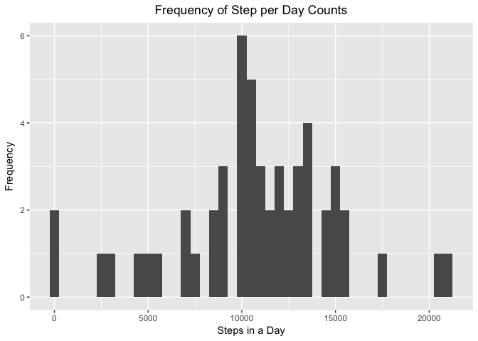
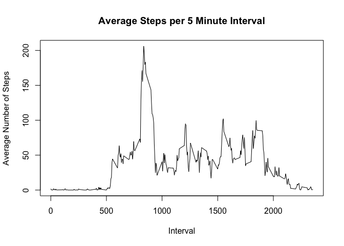
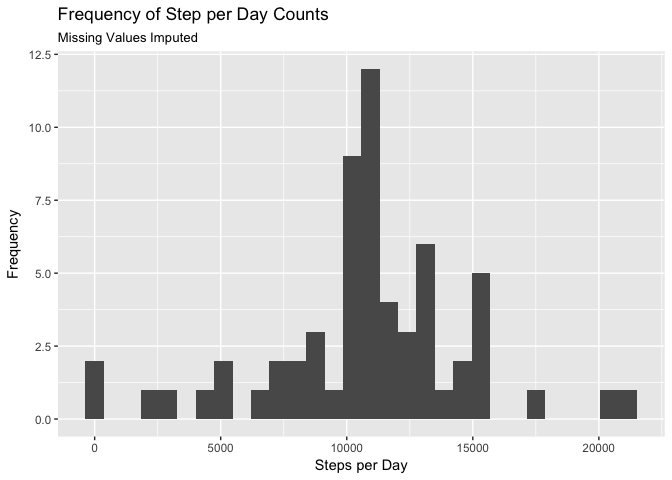

# 5 Reproducible Research: Project 1
10 Aug 2017  


## Loading and preprocessing the data

Show any code that is needed to

1. Load the data (i.e. 𝚛𝚎𝚊𝚍.𝚌𝚜𝚟())

2. Process/transform the data (if necessary) into a format suitable for your analysis


```r
# download and unzip the file
if (!file.exists("amd.zip")) {
    url <- "https://d396qusza40orc.cloudfront.net/repdata%2Fdata%2Factivity.zip"
    download(url, dest = "amd.zip", mode = "wb") 
    unzip("amd.zip", exdir = "./")
}

# read file into dataframe
if (!exists("amd")) {
  amd <- read.csv("activity.csv")
}

# convert date data to Date type
library(lubridate)
amd$date <- ymd(amd$date)

# formatting for output to R Markdown
inline_hook <- function(x) {
  if (is.numeric(x)) {
    format(x, digits = 5)
  } else x
}
knitr::knit_hooks$set(inline = inline_hook)
```
*Commit Requirement 1. Code for reading in the dataset and/or processing the data*

## What is mean total number of steps taken per day?
For this part of the assignment, you can ignore the missing values in the dataset.

1. Calculate the total number of steps taken per day

```r
# create a df summing steps per day
library(dplyr)
daily_amd <- amd %>%
    group_by(date) %>%
    summarise(sumsteps = sum(steps))

head(daily_amd, 6)
```

```
## # A tibble: 6 × 2
##         date sumsteps
##       <date>    <int>
## 1 2012-10-01       NA
## 2 2012-10-02      126
## 3 2012-10-03    11352
## 4 2012-10-04    12116
## 5 2012-10-05    13294
## 6 2012-10-06    15420
```

2. Make a histogram of the total number of steps taken each day.


```r
library(ggplot2)
ggplot(data = daily_amd, aes(x = sumsteps)) + 
        geom_histogram(binwidth = 500) + 
        xlab("Steps in a Day") + 
        ylab("Frequency") + 
        ggtitle("Frequency of Step per Day Counts") +
        theme(plot.title = element_text(hjust = 0.5))
```

```
## Warning: Removed 8 rows containing non-finite values (stat_bin).
```

<!-- -->

*Commit Requirement 2. Histogram of the total number of steps taken each day*

3. Calculate and report the mean and median of the total number of steps taken per day.


```r
daily_step_mean <- mean(daily_amd$sumsteps, na.rm = TRUE)
daily_step_median <- median(daily_amd$sumsteps, na.rm = TRUE)
```

The mean number of steps taken per day was 10766, and the median was 10765. 


*Commit Requirement 3. Mean and median number of steps taken each day*

## What is the average daily activity pattern?

1. Make a time series plot (i.e. 𝚝𝚢𝚙𝚎 = "𝚕") of the 5-minute interval (x-axis) and the average number of steps taken, averaged across all days (y-axis)


```r
# create a df of average steps per interval
library(dplyr)
amd_byinterval <- amd %>%
    na.omit() %>%
    group_by(interval) %>%
    summarise(meansteps = mean(steps))
```


```r
with(amd_byinterval, plot(x = interval, y = meansteps, 
                          type = "l", 
                          xlab = "Interval",
                          ylab = "Average Number of Steps"))
title(main = "Average Steps per 5 Minute Interval")
```

<!-- -->

*Commit Requirement 4. Time series plot of the average number of steps taken*

2. Which 5-minute interval, on average across all the days in the dataset, contains the maximum number of steps?


```r
# subset for value of interval in row with maximum number of mean steps
meanstep_row <- subset(amd_byinterval, amd_byinterval$meansteps == max(amd_byinterval$meansteps))
meanstep_row[[1]]
```

```
## [1] 835
```
On average across all days in the dataset, the 5-minute interval 835 contains the maximum number of steps.

*Commit Requirement 5. The 5-minute interval that, on average, contains the maximum number of steps*

## Imputing missing values

Note that there are a number of days/intervals where there are missing values (coded as 𝙽𝙰). The presence of missing days may introduce bias into some calculations or summaries of the data.

1. Calculate and report the total number of missing values in the dataset (i.e. the total number of rows with 𝙽𝙰s)


```r
sapply(amd, function(x) {sum(is.na(x))})
```

```
##    steps     date interval 
##     2304        0        0
```
There are 2304 rows with missing values, all of them found in the steps column.

2. Devise a strategy for filling in all of the missing values in the dataset. The strategy does not need to be sophisticated. For example, you could use the mean/median for that day, or the mean for that 5-minute interval, etc.

I chose to replace NA values with the mean for that 5-minute interval because human activity typically follows daily patterns (e.g. sleeping at night, activity during daytime) and so that would be a better replacement metric than the mean or median of that particular day. 

3. Create a new dataset that is equal to the original dataset but with the missing data filled in.


```r
# which indexes in amd have missing values
missing_index <- which(is.na(amd$steps))

# create a copy of amd that will receive replacement values
replaced_amd <- amd

for (i in missing_index) {
    # interval value for ith row
    interval_value <- amd[i,][[3]]
    # value of meansteps for given interval set equal to missing value in replacement df
    replaced_amd$steps[i] <- subset(amd_byinterval, 
                               amd_byinterval$interval == 
                                   interval_value)[[2]]
}

# confirm all rows replaced
sapply(replaced_amd, function(x) {sum(is.na(x))})
```

```
##    steps     date interval 
##        0        0        0
```
*Commit Requirement 6. Code to describe and show a strategy for imputing missing data*

For easy comparison of the imputed values, see the first few rows of amd_by_interval and compare with the corresponding rows in replaced_amd.

```r
head(amd_byinterval)
```

```
## # A tibble: 6 × 2
##   interval meansteps
##      <int>     <dbl>
## 1        0 1.7169811
## 2        5 0.3396226
## 3       10 0.1320755
## 4       15 0.1509434
## 5       20 0.0754717
## 6       25 2.0943396
```


```r
head(replaced_amd)
```

```
##       steps       date interval
## 1 1.7169811 2012-10-01        0
## 2 0.3396226 2012-10-01        5
## 3 0.1320755 2012-10-01       10
## 4 0.1509434 2012-10-01       15
## 5 0.0754717 2012-10-01       20
## 6 2.0943396 2012-10-01       25
```

4. Make a histogram of the total number of steps taken each day and Calculate and report the mean and median total number of steps taken per day. Do these values differ from the estimates from the first part of the assignment? What is the impact of imputing missing data on the estimates of the total daily number of steps?


```r
# recreate previous df of steps summed per day but with no missing values
replaced_daily_amd <- replaced_amd %>%
    group_by(date) %>%
    summarise(sumsteps = sum(steps))
```


```r
# histogram of total steps per day (but add missing values dataset)
ggplot(data = replaced_daily_amd, aes(x = sumsteps)) +
        geom_histogram() +
        ggtitle("Frequency of Step per Day Counts", subtitle = "Missing Values Imputed") +
        xlab("Steps per Day") +
        ylab("Frequency")
```

```
## `stat_bin()` using `bins = 30`. Pick better value with `binwidth`.
```

<!-- -->

*Commit Requirement 7. Histogram of the total number of steps taken each day after missing values are imputed*


```r
mean(replaced_daily_amd$sumsteps)
```

```
## [1] 10766.19
```

```r
median(replaced_daily_amd$sumsteps)
```

```
## [1] 10766.19
```
You can see that these mean and median values from the imputed dataset are actually the same as the original mean of 10766 and median of 10765. 

## Are there differences in activity patterns between weekdays and weekends?
For this part the 𝚠𝚎𝚎𝚔𝚍𝚊𝚢𝚜() function may be of some help here. Use the dataset with the filled-in missing values for this part.

1. Create a new factor variable in the dataset with two levels – “weekday” and “weekend” indicating whether a given date is a weekday or weekend day.


```r
# assign day of week to each date
replaced_amd$day <- wday(replaced_amd$date, label = TRUE)

# create a factor variable designating days of weekday or weekend
replaced_amd$weekdayend <- factor(c("weekday", "weekend"))

# make assignments based on day value
replaced_amd$weekdayend <- ifelse(replaced_amd$day == "Sun" | replaced_amd$day == "Sat", "weekend", "weekday")
```

2. Make a panel plot containing a time series plot (i.e. 𝚝𝚢𝚙𝚎 = "𝚕") of the 5-minute interval (x-axis) and the average number of steps taken, averaged across all weekday days or weekend days (y-axis). See the README file in the GitHub repository to see an example of what this plot should look like using simulated data.


```r
# create a df of mean steps grouped by weekend/weekday and interval
replaced_amd_wkdayend <- replaced_amd %>%
    group_by(weekdayend, interval) %>%
    summarise(meansteps = mean(steps))
```


```r
library(lattice)
xyplot(meansteps ~ interval | weekdayend, 
       data = replaced_amd_wkdayend, 
       layout = c(1,2),
       xlab = "5 minute interval",
       ylab = "Average number of steps",
       main = "Average Steps per 5 minute interval")
```

<!-- -->

*Commit Requirement 8. Panel plot comparing the average number of steps taken per 5-minute interval across weekdays and weekends*
