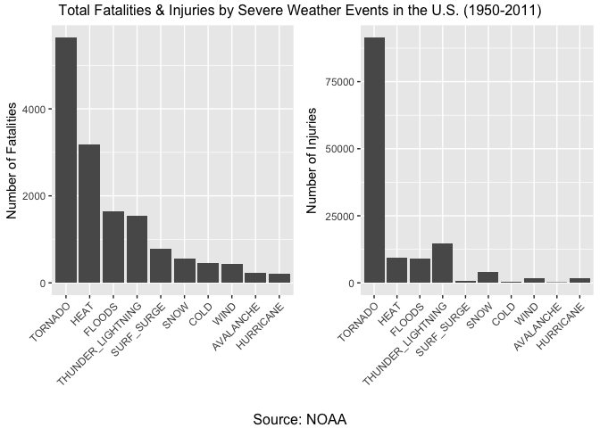
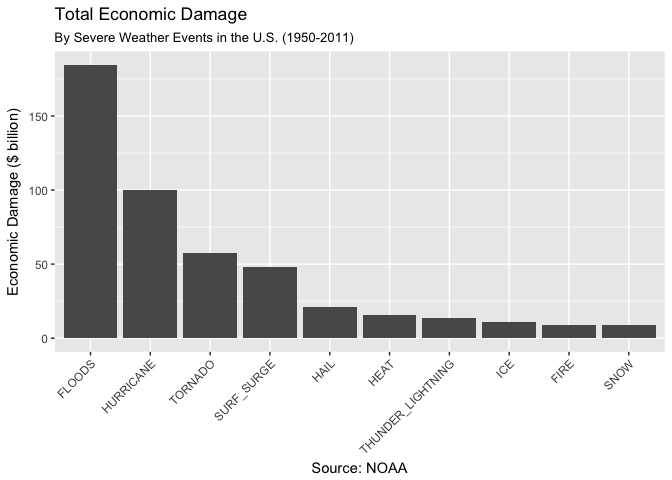

# U.S. Health Consequences and Economic Damage from Severe Weather Events (1950-2011)


## Synopsis

Using a dataset collected by the U.S. National Oceanic and Atmospheric Administration (NOAA) from 1950 to 2011, this report seeks to investigate two questions:

* Across the United States, which types of events are most harmful with respect to population health?

* Across the United States, which types of events have the greatest economic consequences?

The data suggests that tornadoes have been overwhelmingly the most damaging weather event to population health in terms of both fatalities and injuries, while floods have imposed the greatest amount of economic damage in terms of both property and crop damage.

## Data Processing

First download and read in the necessary NOAA data.

```r
# download the file
if (!file.exists("noaa.zip")) {
    url <- "https://d396qusza40orc.cloudfront.net/repdata%2Fdata%2FStormData.csv.bz2"
    download.file(url, dest = "noaa.zip", mode = "wb") 
}

# read file into dataframe, stripping whitespace
if (!exists("noaa")) {
  noaa <- read.csv("noaa.zip", strip.white = TRUE)
}
```

Here you can find links to the [Documentation](https://d396qusza40orc.cloudfront.net/repdata%2Fpeer2_doc%2Fpd01016005curr.pdf) and [FAQ](https://d396qusza40orc.cloudfront.net/repdata%2Fpeer2_doc%2FNCDC%20Storm%20Events-FAQ%20Page.pdf).

### Preparing EVTYPE

A key variable needed to answer our questions is EVTYPE, which is a factor variable categorizing the type of severe weather event. 


```r
# convert text to uppers
noaa$EVTYPE <- as.factor(toupper(noaa$EVTYPE))
initial_levels <- nlevels(noaa$EVTYPE)
```

The dataset has 898 unique levels of environmental events. These labels are very specific and more troublingly overlapping. To give just one example, "FLOODS" and "FLOODING" should be considered together. In order to make comparative sense of the associated costs of a given event, we need to group the factors into larger, more coherent variables. 

We can do this by creating vectors for a more generic environmental event with the grep function. There is a degree of subjectivity of how to group the factors, but it is definitely necessary considering the dataset. I mostly used an iterative process adding a word or phrase to a  group, seeing if any factors belonged in a particular group, and then refining the grep statements accordingly.


```r
# define vectors for larger storm groups

flood <- c("FLOO", "RAIN", "FLD", "WET", "STREAM", "PRECIP", "SHOWER", "RAPIDLY RISING WATER")
flood_vec <- unique(grep(paste(flood, collapse = "|"), noaa$EVTYPE, value = TRUE))

land <- c("LAND", "MUD", "ROCK SLIDE")
land_vec <- unique(grep(paste(land, collapse = "|"), noaa$EVTYPE, value = TRUE))

thund_ligh <- c("TSTM", "THUN", "LIGHTNING", "TUNDER", "LIGHTING")
thund_ligh_vec <- unique(grep(paste(thund_ligh, collapse = "|"), noaa$EVTYPE, value = TRUE))

fog_vec <- unique(grep(c("FOG"), noaa$EVTYPE, value = TRUE))

wind <- c("WIND", "WND", "BURST")
wind_vec <- unique(grep(paste(wind, collapse = "|"), noaa$EVTYPE, value = TRUE))

fire <- c("FIRE", "SMOKE")
fire_vec <- unique(grep(paste(fire, collapse = "|"), noaa$EVTYPE, value = TRUE))

cold <- c("COLD", "^LOW", "CHILL", "HYPO", "LOW TEMP", "HYPER", "RECORD COOL", "UNSEASONABLY COOL", "RECORD LOW", "COOL SPELL")
cold_vec <- unique(grep(paste(cold, collapse = "|"), noaa$EVTYPE, value = TRUE))

ice <- c("ICE", "ICY", "FROST", "FREEZ")
ice_vec <- unique(grep(paste(ice, collapse = "|"), noaa$EVTYPE, value = TRUE))

avalan_vec <- unique(grep(c("AVALAN"), noaa$EVTYPE, value = TRUE))

snow <- c("SNOW", "BLIZ", "WINT", "HEAVY MIX")
snow_vec <- unique(grep(paste(snow, collapse = "|"), noaa$EVTYPE, value = TRUE))

surge <- c("STORM SURGE", "SURF","SEAS$", "SWELL", "RIP", "WAVE", "TIDE", "HIGH WATER")
surge_vec <- unique(grep(paste(surge, collapse = "|"), noaa$EVTYPE, value = TRUE))

tornado <- c("TORN", "FUNNEL", "SPOUT", "WALL CLOUD", "GUSTNADO")
tornado_vec <- unique(grep(paste(tornado, collapse = "|"), noaa$EVTYPE, value = TRUE))

dam_vec <- unique(grep(c("DAM"), noaa$EVTYPE, value = TRUE))

hail_vec <- unique(grep(c("HAIL"), noaa$EVTYPE, value = TRUE))

dust_vec <- unique(grep(c("DUST"), noaa$EVTYPE, value = TRUE))

heat <- c("HEAT", "DROUGHT","DRY","WARM","HOT", "DRIEST", "RECORD HIGH", "HIGH TEMP")
heat_vec <- unique(grep(paste(heat, collapse = "|"), noaa$EVTYPE, value = TRUE))

hurricane <- c("HURR", "TROPICAL", "COASTAL", "FLOYD", "TYPHOON")
hurricane_vec <- unique(grep(paste(hurricane, collapse = "|"), noaa$EVTYPE, value = TRUE))

volc_vec <- unique(grep(c("VOLC"), noaa$EVTYPE, value = TRUE))

sleet_vec <- unique(grep(c("SLEET"), noaa$EVTYPE, value = TRUE))

beach_vec <- unique(grep(c("BEACH EROS"), noaa$EVTYPE, value = TRUE))

summ_vec <- unique(grep(c("SUMM"), noaa$EVTYPE, value = TRUE))
```

Given that some original factors include multiple events, (e.g. RAIN and SNOW), the order in which the vectors are grouped below is important because text catching in later grep searches will be overwritten into the new group. For an event that could seemingly be placed into two categories, my strategy was to place that event in the harsher or more extreme category.

For example, the goal for the FLOODS category was to get observations primarily related to the accumulation of water. "FLASH FLOODING / LANDSLIDE"" was put into the landslide category as opposed to the FLOODS category. "RAIN/SNOW" would be put into SNOW.


```r
library(forcats)
# create new column with grouped factor levels
noaa$type2 <- fct_collapse(noaa$EVTYPE,
    AVALANCHE = avalan_vec,
    BEACH_EROSION = beach_vec,
    WIND = wind_vec,
    FLOODS = flood_vec,
    THUNDER_LIGHTNING = thund_ligh_vec,
    FIRE = fire_vec,
    DAM = dam_vec,
    SLEET = sleet_vec,
    COLD = cold_vec,
    ICE = ice_vec,
    SNOW = snow_vec,
    SURF_SURGE = surge_vec,
    TORNADO = tornado_vec,
    HAIL = hail_vec,
    HEAT = heat_vec,
    HURRICANE = hurricane_vec,
    VOLCANO = volc_vec,
    DUST = dust_vec,
    FOG = fog_vec,
    LANDSLIDE = land_vec,
    SUMMARY = summ_vec
)

final_levels <- nlevels(noaa$type2)
final_levels
```

```
## [1] 49
```

Now we have reduced our dataset to only 49. This is a much more reasonable amout of categories to consider. Moreover, we can primarily consider about 20-30 of these-- the others mostly being erroneous or incomplete descriptions.

### Preparing FATALITIES AND INJURIES

With regards to the first question of investigation investigating population health, two variables are of use: FATALITIES AND INJURIES. We can group the dataset by the larger type variable we just created and sum totals for fatalities and injuries.

Because it is still difficult to analyze our results with 49 different categories, we can arrange the data in descending order and take the top ten observations. This will make for clearer plots.


```r
# group by event type and sum/sort fatalities and injuries
library(dplyr)
pop_health <- noaa %>%
    group_by(type2) %>%
    summarise(FATALITIES = sum(FATALITIES),
              INJURIES = sum(INJURIES)) %>%
    arrange(desc(FATALITIES), desc(INJURIES))

# for plotting clarity keep the top ten event types
pop_health_top <- pop_health[1:10,]
```

We can also create a tidy dataset if needed.


```r
library(tidyr)
# if tidy dataset needed
gather.pop_health <- gather(pop_health, key, value, -type2)
```

### Preparing PROPERTY DAMAGE AND CROP DAMAGE

With regards to the second question investigating economic damage, we have the variables PROPDMG and CROPDMG. Both of these have accompanying variables, PROPDMGEXP and CROPDMGEXP, which serve to amplify the damage into thousands, millions, billions, etc.

We must first create dollar values for both property and crop damage. Then we can combine these two amounts into total damage.


```r
# convert to upper to remove lower case values
noaa$PROPDMGEXP <- as.factor(toupper(noaa$PROPDMGEXP))
noaa$CROPDMGEXP <- as.factor(toupper(noaa$CROPDMGEXP))

# set the new exponent levels for PROPDMG
noaa$pexp[noaa$PROPDMGEXP == "" | 
              noaa$PROPDMGEXP == "-" |
              noaa$PROPDMGEXP == "?" | 
              noaa$PROPDMGEXP == "+" | 
              noaa$PROPDMGEXP == "0"] <- 0
noaa$pexp[noaa$PROPDMGEXP == "1"] <- 1
noaa$pexp[noaa$PROPDMGEXP == "H" | noaa$PROPDMGEXP == "2"] <- 2
noaa$pexp[noaa$PROPDMGEXP == "K" | noaa$PROPDMGEXP == "3"] <- 3
noaa$pexp[noaa$PROPDMGEXP == "4"] <- 4
noaa$pexp[noaa$PROPDMGEXP == "5"] <- 5
noaa$pexp[noaa$PROPDMGEXP == "M" | noaa$PROPDMGEXP == "6"] <- 6
noaa$pexp[noaa$PROPDMGEXP == "7"] <- 7
noaa$pexp[noaa$PROPDMGEXP == "8"] <- 8
noaa$pexp[noaa$PROPDMGEXP == "B"] <- 9

# set the new exponent levels for CROPDMG
noaa$cexp[noaa$CROPDMGEXP == "" | 
              noaa$CROPDMGEXP == "?" | 
              noaa$CROPDMGEXP == "0"] <- 0
noaa$cexp[noaa$CROPDMGEXP == "2"] <- 2
noaa$cexp[noaa$CROPDMGEXP == "K"] <- 3
noaa$cexp[noaa$CROPDMGEXP == "M"] <- 6
noaa$cexp[noaa$CROPDMGEXP == "B"] <- 9

# convert to dollar amount
noaa$ptot <- noaa$PROPDMG * 10 ^ noaa$pexp
noaa$ctot <- noaa$CROPDMG * 10 ^ noaa$cexp
```


```r
# group by type and sum property and crop damage totals
dmg <- noaa %>%
    group_by(type2) %>%
    summarise(DMG = sum(ptot + ctot)) %>%
    arrange(desc(DMG))

# for plotting clarity change the scale to billions
dmg$dmg_b <- dmg$DMG / 1000000000

# for plotting clarity keep the top ten event types
dmg_top <- dmg[1:10,]
```

## Results

After preparing the data with the above transformations, we can plot the data to answer our questions.


```r
# plot fatalities
library(ggplot2)
p1 <- ggplot(pop_health_top, aes(x = reorder(type2, -FATALITIES), y = FATALITIES)) + 
    geom_bar(stat = "identity") +
    xlab("") +
    ylab("Number of Fatalities") +
    theme(axis.text.x = element_text(angle = 45, hjust = 1))

# plot injuries
p2 <- ggplot(pop_health_top, aes(x = reorder(type2, -FATALITIES), y = INJURIES)) + 
    geom_bar(stat = "identity") +
    xlab("") +
    ylab("Number of Injuries") +
    theme(axis.text.x = element_text(angle = 45, hjust = 1))

library(gridExtra)
grid.arrange(p1, p2, ncol = 2, top = "Total Fatalities & Injuries by Severe Weather Events in the U.S. (1950-2011)", bottom = "Source: NOAA")
```

<!-- -->

From the plot above, according to the NOAA data, we can report that tornadoes have been by far the most damaging severe weather event to population health in the U.S. from 1950-2011, as measured in terms of fatalities and injuries. Tornadoes are held responsible for 5,639 fatalities and 91,439 injuries during this period.


```r
# plot total economic damage
d1 <- ggplot(dmg_top, aes(x = reorder(type2, -dmg_b), y = dmg_b)) + 
    geom_bar(stat = "identity") +
    xlab("Source: NOAA") +
    theme(axis.text.x = element_text(angle = 45, hjust = 1)) +
    ggtitle("Total Economic Damage", subtitle = "By Severe Weather Events in the U.S. (1950-2011)") +
    scale_y_continuous(name = "Economic Damage ($ billion)", labels = scales::comma)
d1
```

<!-- -->

The plot of total economic damage shows that floods can be held responsible for the greatest economic damage (in terms of property and crop damage). According to the dataset, floods are responsible for more than \$184 billion in economic damage from 1950 to 2011. Hurricanes were the next most damaging at \$99.7 billion. 


