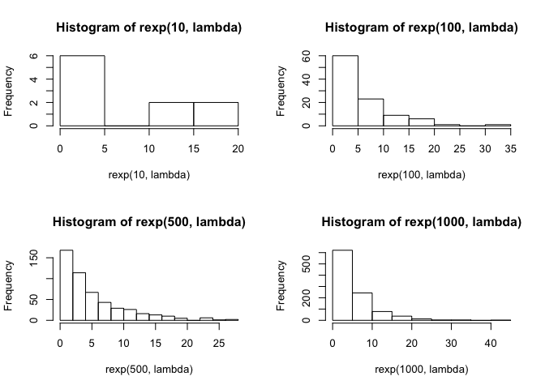
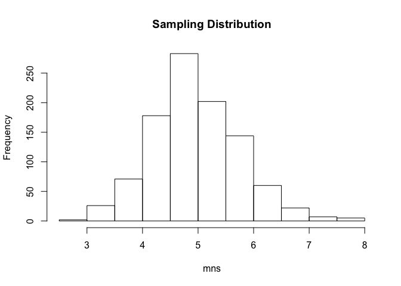
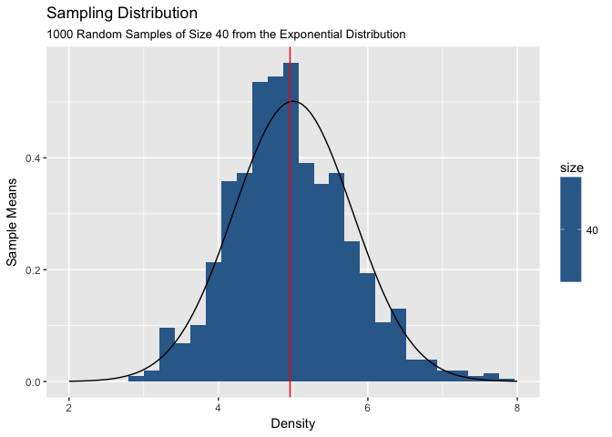

## Overview

The goal of this project is to arrive at a better understanding of the Central Limit Theorem through a demonstration of its properties as applied to the exponential distribution.

### The Central Limit Theorem

The Central Limit Theorem is one of the most important theorems in statistics and probability theory because it implies that, under certain assumptions, the distributions of means of a large number of observations will be approximately normal even if the underlying distributions are non-normal (such as an exponential distribution in this case). This [applet](https://gallery.shinyapps.io/CLT_mean/) is a useful tool for understanding the Central Limit Theorem as applied to sample means of normal, uniform and skewed distributions.

*Assumptions for CLT*

In order for the Central Limit Theorem to be applicable, a few conditions must apply:

1. The data must be a random sample.

2. The sample values must be independent of each other.

3. The sample size should be no more than 10% of the population.

4. The sample size must be sufficiently large.

As we will see below, all of these conditons will be met as we are using the `rexp` function to generate a large number of random samples.

### The Exponential Distribution

The Exponential Distribution is a special case of the Gamma distribution that describes the time between events in a Poisson process. A useful introduction to working with the exponential distribution in R is provided by [StatsTutor](https://www.youtube.com/watch?v=khpBSFwHryI).

## Simulations

R makes it very easy to run simulations from the exponential distribution. The `rexp` function is the random generation function for the exponential distribution. We have to specify two parameters, `n` and `rate`. Using `lambda = 0.2` as specified in the instructions, we can plot histograms of a range of random draws from the exponential distribution, up until `n = 1000` as specified in the instructions.


```r
lambda = 0.2
par(mfrow = c(2,2))
set.seed(50)
hist(rexp(10, lambda))
hist(rexp(100, lambda))
hist(rexp(500, lambda))
hist(rexp(1000, lambda))
```

<!-- -->

We can see that this distribution is heavily right skewed. As the sample size increases, the distribution gets closer to a theoretical exponential distribution.

I want to save the last sample of 1000 draws for future use.

```r
set.seed(50)
simdata <- rexp(1000, lambda)
```

Now we want to take random samples from this same distribution. Specifically, we've been asked to take 1000 samples, each of size 40. Each of these 1000 samples of size 40 has its own sample mean. The distribution of these 1000 sample means create a sampling distribution.

We can code this in R and plot a histogram of the sampling distribution of means of 1000 random samples, each consisting of 40 observations from an exponential distribution with lambda = 0.2. I'll save these sample means into a dataframe in order to visualize it with ggplot.


```r
# create sampling distribution
mns = NULL
for (i in 1 : 1000) mns = c(mns, mean(rexp(40, lambda)))
hist(mns, main = "Sampling Distribution")
```

<!-- -->

```r
sampling_dist <- data.frame(mns, size = 40)
```

We can see that the shape of the sampling distribution of means of 1000 random samples of size 40 from the exponential distribution looks approximately normal, whereas the distribution of 1000 random samples from the exponential distribution was highly right skewed. We know that this has to be the case because of the Central Limit Theorem.

## Sample Mean versus Theoretical Mean

Now that we have run and plotted our simulations, let's take a closer look at the sample mean and the theoretical mean.

The theoretical mean of the exponential distribution is `1/lambda`, and so this is simply 5.


```r
theoreticalMean <- 1/lambda
theoreticalMean
```

```
## [1] 5
```

If we took the mean of our 1000 random draws from the exponential distribution, we would expect it to be close to the theoretical mean.


```r
mean(simdata)
```

```
## [1] 5.286806
```

At 5.287, we find this to be the case. It would be even closer if we increased the number of samples. However, we should also expect the mean of the sample means to be even closer to the theoretical mean according to the CLT.


```r
mean(sampling_dist$mns)
```

```
## [1] 4.958321
```

At 4.958, we also find this to be true. Let's also create a 95% confidence interval for the mean of sample means.


```r
# 95% confidence interval for the sample mean
s <- 1/lambda
n <- 1000
mean(sampling_dist$mns) + c(-1,1)*qnorm(0.975)*s/sqrt(n)
```

```
## [1] 4.648423 5.268218
```

We can interpret this confidence interval to mean that if repeated samples were taken and the 95% confidence interval was computed for each sample, 95% of those similarly constructed intervals between 4.65 and 5.27 would contain the true population mean.

## Sample Variance versus Theoretical Variance

Does a similar relationship hold with regards to variance?

The theoretical standard deviation of the exponential distribution is `1/lambda`, and so the theoretical variance is `1/lambda^2`.

We can then find the theoretical variance of our sampling distribution to be 0.625.


```r
# theoretical variance
((1/lambda)/(sqrt(40)))^2
```

```
## [1] 0.625
```

We can calculate the variance for our sampling distribution with the `var` function, and get a result of 0.633 that is quite close. This is also what we expect according to the Central Limit Theorem.


```r
# variance of sampling distribution
var(sampling_dist$mns)
```

```
## [1] 0.6330899
```

## Distribution

Plotting the sampling distribution against the theoretical normal distribution with the parameters of the theoretical distribution can help make the impact of the CLT on the sampling distribution clearer.


```r
library(ggplot2)
ggplot(sampling_dist, aes(x = mns, fill = size)) + 
    geom_histogram(aes(y = ..density..)) +
    stat_function(fun = dnorm, args = list(mean = 1/lambda, sd = sd(mns))) +
    xlim(2,8) +
    geom_vline(xintercept = mean(mns), color = "red") +
    labs(title = "Sampling Distribution", 
         subtitle = "1000 Random Samples of Size 40 from the Exponential Distribution",
         x = "Density",
         y = "Sample Means")
```

<!-- -->

The histogram above certainly gives the impression that our sampling distribution is approximately normal, but we can do a more formal check with a diagnostic test, specifically a normal quantile plot.


```r
qqnorm(sampling_dist$mns)
qqline(sampling_dist$mns)
```

<!-- -->

We see very little deviation from the line in this plot, suggesting our sampling distribution is in fact approximately normal.

## Conclusion

The key takeaway from this investigation is that the Central Limit Theorem, when its conditions are met, allows us to take a non-normal distribution (such as a highly skewed exponential distribution), generate enough random samples from it, take the mean of those samples, and the distribution of those sample means will be approximately normal.
