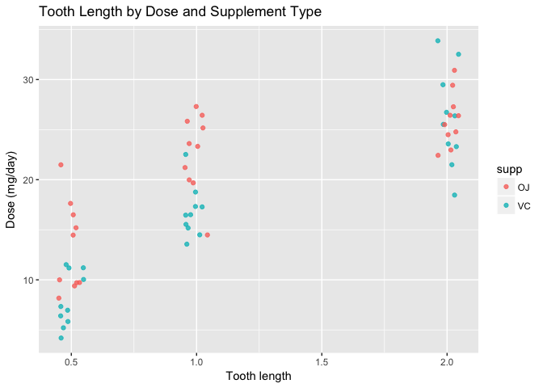
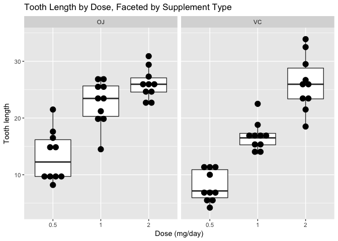
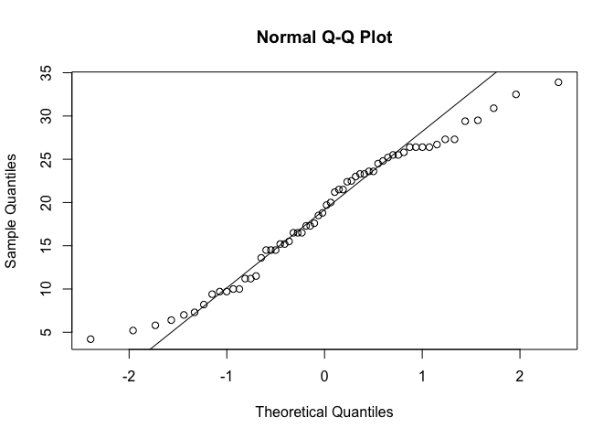

## Overview

The `ToothGrowth` dataset in the `datasets` package documents the effect of Vitamin C on tooth growth in guinea pigs. 

The dataset holds 60 observations of tooth growth response, classified by one of three levels of dosage (0.5, 1, 2 mg/day) and one of two delivery methods (orange juice or ascorbic acid). More information can be found by typing `?ToothGrowth` in the console after loading the package.

This report is a brief investigation into the dataset to compare tooth growth by dose and supplement using confidence intervals and hypothesis tests.

## Exploratory Data Analysis


```r
# load data and libraries
data("ToothGrowth")
library(ggplot2)
library(dplyr)
library(knitr)
```

We could start by plotting box and dotplots of `len` by `supp` to show that OJ appears to encourage slightly higher tooth growth. I prefer including the dotplot because it shows the actual data points instead of just the summary values. However we know that this fails to take into account the differences in dosages, which we would think to be an important factor.


```r
ggplot(ToothGrowth, aes(x = supp, y = len)) + 
    geom_boxplot() +
    geom_dotplot(binaxis = 'y', stackdir = 'center') +
    labs(x = "Tooth length", y = "Supplement type", title = "Tooth Length by Supplement Type")
```

<!-- -->

We can try to visualize this extra variable first in a scatterplot. I've added a small amount of jitter to make it easier to see each observation and colored the points according to `supp`. In other places, we'll largely treat `dose` as a factor variable, but this plot has the advantage of showing the numeric difference between the levels of `dose`.


```r
ggplot(ToothGrowth, aes(x = dose, y = len, color = supp)) +
    geom_jitter(width = 0.05, alpha = 0.8) +
    labs(x = "Tooth length", y = "Dose (mg/day)", title = "Tooth Length by Dose and Supplement Type")
```

<!-- -->

Ultimately though, faceting is probably the best way to understand these relationships. Depending on the researchers' level of interest in `dose` or `supp` as the primary explanatory variable for the response `len`, I'd likely settle on one of the two faceted plots below.


```r
# facet by dose
ggplot(ToothGrowth, aes(x = supp, y = len)) +
    geom_boxplot() +
    geom_dotplot(binaxis = 'y', stackdir = 'center') +
    facet_wrap(~ dose) +
    labs(y = "Tooth length", x = "Supplement type", title = "Tooth Length by Supplement Type, Faceted by Dose")
```

```
## `stat_bindot()` using `bins = 30`. Pick better value with `binwidth`.
```

<!-- -->


```r
# facet by supp
ggplot(ToothGrowth, aes(x = factor(dose), y = len)) +
    geom_boxplot() +
    geom_dotplot(binaxis = 'y', stackdir = 'center') +
    facet_wrap(~ supp) +
    labs(y = "Tooth length", x = "Dose (mg/day)", title = "Tooth Length by Dose, Faceted by Supplement Type")
```

```
## `stat_bindot()` using `bins = 30`. Pick better value with `binwidth`.
```

<!-- -->

Regardless of which figure we choose to present, two trends become clear: 

* Dosage and length appear to have a positive relationship, regardless of the choice of supplement. 

* For a dose of 0.5 or 1 mg/day, OJ appears to be associated with greater length than VC. However, there appears to be almost no difference if the dose reaches 2 mg/day.

## Data Summary

The above relationships can be quantified in the table of summary statistics below.


```r
# calculate summary statistics
tooth_sum <- ToothGrowth %>%
    group_by(supp, dose) %>%
    summarize(n = n(),
              mean = mean(len),
              median = median(len),
              sd = sd(len))
kable(tooth_sum, align = 'c', digits = 3)
```


 supp    dose    n     mean     median     sd   
------  ------  ----  -------  --------  -------
  OJ     0.5     10    13.23    12.25     4.460 
  OJ     1.0     10    22.70    23.45     3.911 
  OJ     2.0     10    26.06    25.95     2.655 
  VC     0.5     10    7.98      7.15     2.747 
  VC     1.0     10    16.77    16.50     2.515 
  VC     2.0     10    26.14    25.95     4.798 

## T-Tests and Confidence Intervals

We can develop hypothesis tests to determine if the differences in tooth growth are significant or should rather be attributed to random chance.

### T-Test Assumptions

Before conducting the t-tests, we should briefly review the necessary assumptions.

* We require a bivariate explanatory variable, in this case supplement. This was entirely under the researchers' control, and so this condition is met.

* We require a continuous response variable, in this case tooth growth length. This is also met as `len` is a numeric variable, although the units are unclear from the literature.

* Observations must be independent. We can assume the researchers properly arranged the groups into random samples, and so this condition holds.

* Data should have a normal distribution with the same variance in each group. Our normal quantile plot suggest the data is approximately normal, and with 60 observations this condition should be satisfied. From our EDA plots above, there may be some difference in variances between tooth growth length in response to the two supplements, but we have accounted for this in our t-tests below by assuming unequal variances.


```r
# normal quantile plot
qqnorm(ToothGrowth$len)
qqline(ToothGrowth$len)
```

<!-- -->

### Test Tooth Growth Length by Supplement

The null hypothesis is that tooth growth length is the same regardless of supplement type. In other words, the true difference in means is = 0. Because there is some ambiguity in our plots, let's try a two-sided test where the alternative hypothesis is that mean tooth growth in response to the OJ supplement is not equal to mean tooth growth in response to the VC supplement.


```r
ttest <- t.test(ToothGrowth$len[ToothGrowth$supp == 'OJ'],
       ToothGrowth$len[ToothGrowth$supp == 'VC'], var.equal = FALSE)
ttest
```

```
## 
## 	Welch Two Sample t-test
## 
## data:  ToothGrowth$len[ToothGrowth$supp == "OJ"] and ToothGrowth$len[ToothGrowth$supp == "VC"]
## t = 1.9153, df = 55.309, p-value = 0.06063
## alternative hypothesis: true difference in means is not equal to 0
## 95 percent confidence interval:
##  -0.1710156  7.5710156
## sample estimates:
## mean of x mean of y 
##  20.66333  16.96333
```

Here we get a p-value of 0.061, and so assuming a confidence level of 95% (an alpha = 0.05), we would fail to reject the null hypothesis. We can interpret this p-value to mean that, assuming the null hypothesis is true, the probability of observing a more extreme test statistic is 0.061.

We can interpret the confidence interval to be that if repeated samples were taken and 95% confidence intervals were constructed for each sample, 95% of intervals from -0.17 to 7.57 would contain the population mean. Because 0 is included in our interval (sometimes the difference in means would be 0), we do not want to reject the null hypothesis.

### Test Tooth Growth Length by Supplement and Dose

We know we should also take into account the size of the dose. We can run multiple t-tests comparing tooth length in response to OJ and VC supplements for each level of dosage. However, because we are doing multiple comparisons, we need to be careful about the family-wise error rate (FWER), or the probability of at least one false positive. We can control this by adopting the Bonferroni correction. We'll simply divide our desired alpha level by the number of tests we are conducting.


```r
# calculate family-wise error rate
alpha <- 0.05
m <- 3
alpha_fwer <- alpha/m
alpha_fwer
```

```
## [1] 0.01666667
```

Because we are doing comparisons for three level of doses, we have three tests and so our new alpha level will be set at 0.0166667. In order for results to be declared statistically significant, our p-values will need to be below this lower threshold.

First create three filtered datasets for each dose and run three t-tests testing the same hypothesis as above (is the true difference in means between tooth growth length in response to supplements OJ and VC equal to 0?) for each level of dosage. Because we have three tests of the same hypothesis, we lower our required threshold for significance using the Bonferroni correction. Note that the confidence intervals in the table below have not been adjusted.


```r
# conduct 3 tests with filtered datasets
test0.5 <- t.test(len ~ supp, data = ToothGrowth[ToothGrowth$dose == 0.5,], var.equal = FALSE)
test1 <- t.test(len ~ supp, data = ToothGrowth[ToothGrowth$dose == 1,], var.equal = FALSE)
test2 <- t.test(len ~ supp, data = ToothGrowth[ToothGrowth$dose == 2,], var.equal = FALSE)

# arrange results in a table
results <- data.frame(
    "dose" = c(0.5,1,2), 
    "t-statistic"  =         c(test0.5$statistic,test1$statistic,test2$statistic),
    "lower" = c(test0.5$conf.int[1],test1$conf.int[1],test2$conf.int[1]),
    "upper" = c(test0.5$conf.int[2],test1$conf.int[2],test2$conf.int[2]),
    "OJ.mean" = c(test0.5$estimate[1],test1$estimate[1],test2$estimate[1]),
    "VC.mean" = c(test0.5$estimate[2],test1$estimate[2],test2$estimate[2]),
    "p.value"  = c(test0.5$p.value,test1$p.value,test2$p.value),
    "less.than.alpha.fwer" = c(TRUE, TRUE, FALSE))

kable(results, align = 'c', caption = "Two sample t-tests comparing OJ and VC supplements", digits = 3)
```


Table: Two sample t-tests comparing OJ and VC supplements

 dose    t.statistic    lower     upper    OJ.mean    VC.mean    p.value    less.than.alpha.fwer 
------  -------------  --------  -------  ---------  ---------  ---------  ----------------------
 0.5        3.170       1.719     8.781     13.23      7.98       0.006             TRUE         
 1.0        4.033       2.802     9.058     22.70      16.77      0.001             TRUE         
 2.0       -0.046       -3.798    3.638     26.06      26.14      0.964            FALSE         

The t-tests yield p-values of 0.006, 0.001, and 0.964 for doses of 0.5, 1 and 2 respectively.

We would make the same decisions using the standard alpha of 0.05 or the more restrictive alpha adjusted by the Bonferroni correction. We can declare the results of the first two tests to be significant, but not the third.

In other words, the true mean of tooth growth length in response to supplements OJ and VC do indeed appear to be significantly different at doses of 0.5 and 1 mg/day. But there is no significant difference at a dose of 2 mg/day. This result reflects well with what we observed in our plots.

## Conclusions

For the researchers, they might have learned that, at lower doses, orange juice (OJ) does seem to be a more effective supplement than ascorbic acid (VC) if the goal is to induce longer tooth growth. But once the dose reached the level of 2 mg/day the difference in length as a response between the two supplements was negligible, suggesting that perhaps there is a natural threshold as to how much tooth growth can be achieved.
