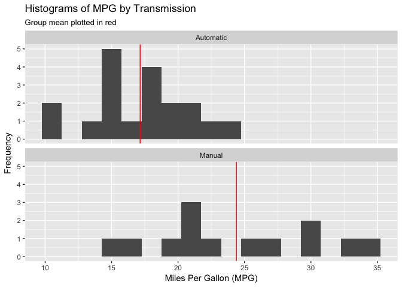
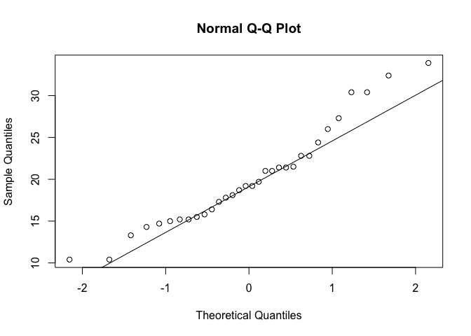
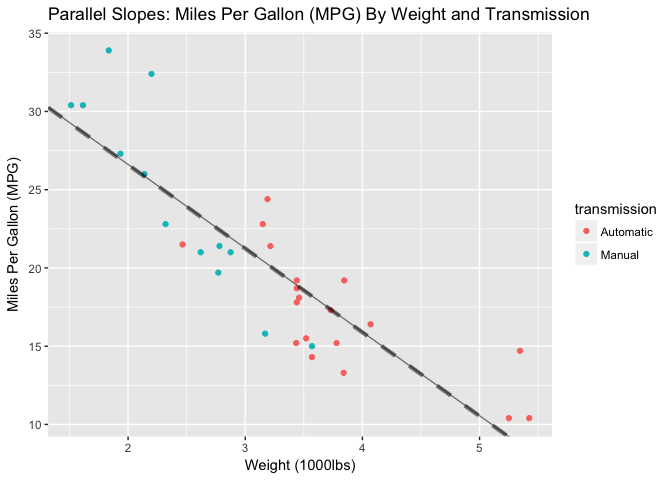
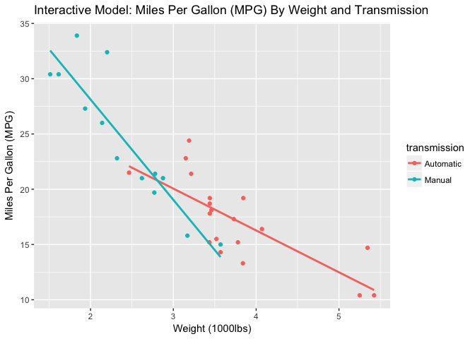
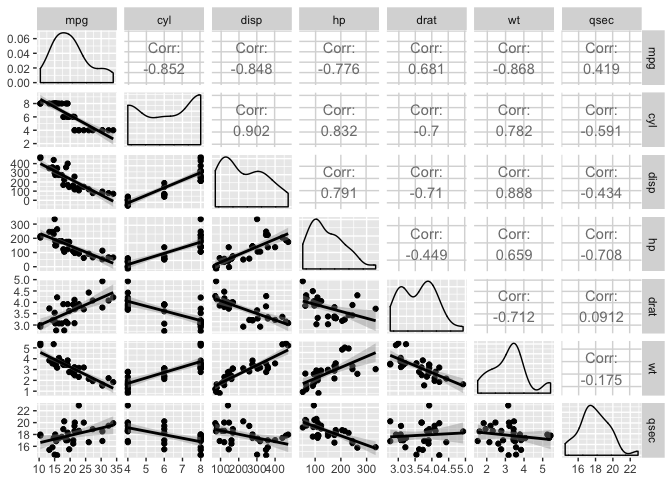
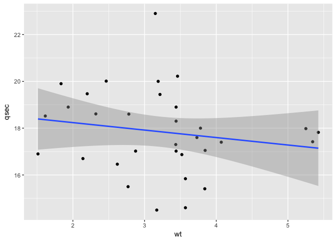
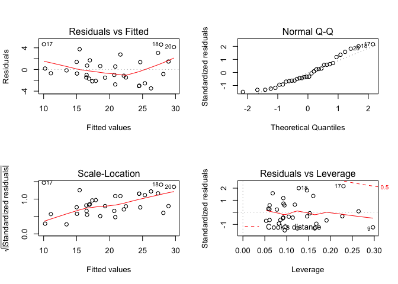

## Executive Summary

In this project we have been asked to investigate two questions concerning the `mtcars` dataset:

1. Is an automatic or manual transmission better for MPG?

2. Quantify the MPG difference between automatic and manual transmissions.

These seemingly simple questions yield very different answers depending on how we choose to model the given data. In this investigation, I'll explore answers to these questions based on a number of different models.

* In a simple model considering only miles per gallon (`mpg`) and `transmission` (transformed from `am`), we expect a car with a manual transmission to gain an extra 7.24 +/- 3.60 miles per gallon more in fuel efficiency than a car with an automatic transmission.

* In a parallel slopes model predicting `mpg` from `transmission` and now the additional variable of weight (`wt`), we expect a car with a manual transmission to gain an extra -0.02 +/- 3.16 miles per gallon in fuel efficiency than a car with an automatic transmission, holding `wt` constant (or essentially no expected difference).

* In the same model but allowing for interaction between `wt` and `transmission`, the expected difference in `mpg` between automatic and manual transmission cars varies as `wt` changes. Holding `wt` constant, for cars greater than approximately 2800 lbs, we expect an automatic transmission car to receive higher `mpg`, whereas for a car lighter than 2800 lbs we would expect a manual transmission car to receive higher `mpg`. 

* After exploring all possible variables for model inclusion, we settled upon a parsimonious model with three explanatory variables (`wt`,  quarter mile time `qsec`, and `transmission`) able to explain 85% of the total variation in `mpg`. Under this model, holding `wt` and `qsec` constant, we expect cars with a manual transmission to get an extra 2.94 +/- 2.89 miles per gallon over cars with an automatic transmission.

Overall, we can conclude that a manual transmission does seem to be a better option than an automatic transmission in terms of miles per gallon, but the magnitude of this difference is tempered if we regress out the effects of a car's weight and quarter mile time.

## Exploratory Data Analysis


```r
# load data and libraries
data("mtcars")
library(ggplot2)
library(dplyr)
library(datasets)
library(knitr)
library(GGally)
library(car)
```

We could start by calculating summary statistics comparing cars with automatic and manual transmissions in terms of `mpg`. I'll first create a new variable to make our labels more interpretable in plots.


```r
# create a new column
mtcars$transmission <- NA

# copy the data from the existing column into the new one
mtcars$transmission <- mtcars$am

# recode data to shorter labels, keeping factor order
mtcars$transmission <- dplyr::recode(mtcars$transmission, `0` = 'Automatic', `1` = 'Manual')

# make it a factor variable
mtcars$transmission <- as.factor(mtcars$transmission)

# summary statistics table
table <- mtcars %>%
    group_by(transmission) %>%
    summarise(n = n(),
              min = min(mpg),
              q1 = quantile(mpg, 0.25),
              median = median(mpg),
              mean_mpg = mean(mpg),
              q3 = quantile(mpg, 0.75),
              max = max(mpg),
              sd_mpg = sd(mpg))
kable(table, align = 'c', digits = 3)
```


 transmission    n     min      q1      median    mean_mpg     q3     max     sd_mpg 
--------------  ----  ------  -------  --------  ----------  ------  ------  --------
  Automatic      19    10.4    14.95     17.3      17.147     19.2    24.4    3.834  
    Manual       13    15.0    21.00     22.8      24.392     30.4    33.9    6.167  

Then let's examine a boxplot overlaid with a dotplot to visualize where the data lie in terms of `mpg` and `transmission`.


```r
# plot mpg by transmission
ggplot(mtcars, aes(y = mpg, x = transmission)) + 
    geom_boxplot() +
    geom_dotplot(binaxis = 'y', stackdir = 'center', fill = 'red') +
    labs(x = "Transmission", y = "Miles Per Gallon (MPG)",
         title = "Miles Per Gallon (MPG) by Transmission")
```

<!-- -->

The plot suggests that cars with manual transmissions tend to perform better in terms of `mpg`. Q1, the median and Q3 are all higher for cars with manual transmissions. In fact, Q1 of manual transmission cars is greater than Q3 of automatic transmission cars. 

However, the actual data points themselves show us that this is by no means always the case. As confirmed by the table, the variance among cars with manual transmissions is greater than those with automatic transmissions. There are examples of automatic cars in the dataset with higher `mpg` than manual cars. 

Comparing histograms is another way to show the overlap in distributions despite manual transmissions having an advantage.


```r
# mutate a mean mpg variable by group
mtcars <- mtcars %>%
    group_by(transmission) %>%
    mutate(mean_mpg = mean(mpg))

# comparative histogram
ggplot(mtcars, aes(x = mpg)) +
    geom_histogram(binwidth = 1.5) +
    facet_wrap(~ transmission, nrow = 2) +
    geom_vline(aes(xintercept = mean_mpg), col = 'red') +
    labs(x = "Miles Per Gallon (MPG)", y = "Frequency",
         title = "Histograms of MPG by Transmission",
         subtitle = "Group mean plotted in red")
```

<!-- -->

Accordingly, we could try to answer the question of whether a manual transmission is 'better' for `mpg` than an automatic transmission by creating a hypothesis test in order to determine whether this perceived advantage among manual transmission cars can be attributed to random chance. At the same time, by creating a confidence interval we will be able to quantify the MPG difference between automatic and manual transmissions (Question 2).

## Inference

### Null and Alternative Hypotheses

Our null hypothesis is that the mean `mpg` for automatic transmission cars is equal to that of manual transmission cars. Our alternative hypothesis is that the mean `mpg` for cars with a manual transmission is greater than that of cars with automatic transmissions.

### Assumptions

Before running such a test, we should evaluate to see if our data matches the required conditions to employ such a test.

* We require a bivariate explanatory variable, in this case `transmission`. As there are only two choices of transmission, this is clearly met.

* We require a continuous response variable, in this case `mpg`. This is also met as `mpg` is a numeric variable.

* Observations must be independent. We do not know how exactly Motor Trend magazine selected these cars for inclusion in the sample, but for this purpose, we can treat it as a random sample and assume independence.

* Data should have a normal distribution with the same variance in each group. Our normal quantile plot below and histograms above suggest that the data, while not heavily skewed, is not sufficiently normal.


```r
# normal quantile plot
qqnorm(mtcars$mpg)
qqline(mtcars$mpg)
```

<!-- -->

However, our general rule of thumb is that sample sizes of more than 30 cross into the domain of the Central Limit Theorem. At a sample size of 32, we just meet this threshold.

### Independent Sample T-Test

With these conditons more or less satisfied, let's perform an independent sample, one-sided t-test to compare `mpg` of automatic and manual transmission cars, based on the null hypothesis above.


```r
# filter data
mpg_manual <- mtcars[mtcars$transmission == "Manual",]$mpg
mpg_auto <- mtcars[mtcars$transmission == "Automatic",]$mpg

# perform t-test
t.test(mpg_manual, mpg_auto, var.equal = FALSE, alternative = 'greater')
```

```
## 
## 	Welch Two Sample t-test
## 
## data:  mpg_manual and mpg_auto
## t = 3.7671, df = 18.332, p-value = 0.0006868
## alternative hypothesis: true difference in means is greater than 0
## 95 percent confidence interval:
##  3.913256      Inf
## sample estimates:
## mean of x mean of y 
##  24.39231  17.14737
```

According to our t-test, if our null hypothesis were in fact true, that the true difference in means between cars with automatic and manual transmissions was 0, the probability of observing this data would be only 0.00069. At any reasonable alpha level, we would reject this null hypothesis in favor of the alternative hypothesis that the mean `mpg` of manual cars is greater than that of automatic cars.

## Simple Linear Regression

It is not really appropriate to fit a linear regression model with binary data, but as it's only a first step to building a more complicated model, it makes sense in this context.

The above t-test should make us fairly confident that the answer to Question 1 is manual. In order to quantify the difference in `mpg` between automatic and manual transmission cars, we can also take a regression approach. We can have R create a linear model with `mpg` as the outcome variable and `transmission` as the predictor variable.


```r
# fit simple linear model
slr <- lm(mpg ~ transmission, data = mtcars)
summary(slr)
```

```
## 
## Call:
## lm(formula = mpg ~ transmission, data = mtcars)
## 
## Residuals:
##     Min      1Q  Median      3Q     Max 
## -9.3923 -3.0923 -0.2974  3.2439  9.5077 
## 
## Coefficients:
##                    Estimate Std. Error t value Pr(>|t|)    
## (Intercept)          17.147      1.125  15.247 1.13e-15 ***
## transmissionManual    7.245      1.764   4.106 0.000285 ***
## ---
## Signif. codes:  0 '***' 0.001 '**' 0.01 '*' 0.05 '.' 0.1 ' ' 1
## 
## Residual standard error: 4.902 on 30 degrees of freedom
## Multiple R-squared:  0.3598,	Adjusted R-squared:  0.3385 
## F-statistic: 16.86 on 1 and 30 DF,  p-value: 0.000285
```

In the coefficient table, we get an estimate for the slope of cars having a manual transmission. For cars having a manual transmission, we expect on average the car to have an estimated 7.24 miles per gallon more than those with an automatic transmission. 

This would be our single best answer to quantifying the difference in miles per gallon according to transmission alone. But we also want to specify the uncertainty around this estimate, and we can do this with confidence intervals.

### Confidence Intervals

The 95% confidence interval for the transmission coefficient suggests that, if we repeatedly collected samples of this size and constructed intervals for each sample, 95% of intervals between 3.64 and 10.85 would contain the true slope coefficient for having a manual transmission. Being far above 0, makes us very confident that having a manual transmission has a positive effect on mpg compared to an automatic transmission.

We can also create confidence intervals of the fuel efficiency of manual and automatic cars.


```r
# confidence intervals for automatic and manual transmission cars
ci_a <- predict(slr, newdata = data.frame(transmission = "Automatic"), interval = "confidence")
ci_m <- predict(slr, newdata = data.frame(transmission = "Manual"), interval = "confidence")

# arrange in a table
ci <- data.frame(Transmission = c("Automatic", "Manual"),
           Lower = c(ci_a[2], ci_m[2]),
           Fit = c(ci_a[1], ci_m[1]),
           Upper = c(ci_a[3], ci_m[3]))
kable(ci, digits = 3, align = 'c', caption = "Simple Linear Regression: MPG Confidence Intervals")
```


Table: Simple Linear Regression: MPG Confidence Intervals

 Transmission    Lower      Fit      Upper  
--------------  --------  --------  --------
  Automatic      14.851    17.147    19.444 
    Manual       21.616    24.392    27.169 

This table first shows us the fit estimate, and the lower and upper bounds of a 95% confidence intervals for an automatic and manual transmission car, respectively.

If we take the fit estimate of an automatic car, and add the slope coefficient of a manual transmission above, we see that this equals the estimate for a manual transmission car. We can also see that the upper bound confidence interval for `mpg` of an automatic transmission car is still below the lower bound confidence interval for `mpg` of a manual transmission car.

### Prediction Intervals

What if instead we wanted a prediction interval for this model?


```r
# prediction intervals for automatic and manual transmission cars
pi_a <- predict(slr, newdata = data.frame(transmission = "Automatic"), interval = "predict")
pi_m <- predict(slr, newdata = data.frame(transmission = "Manual"), interval = "predict")

# arrange in a table
pi <- data.frame(Transmission = c("Automatic", "Manual"),
           Lower = c(pi_a[2], pi_m[2]),
           Fit = c(pi_a[1], pi_m[1]),
           Upper = c(pi_a[3], pi_m[3]))
kable(pi, digits = 3, align = 'c', caption = "Simple Linear Regression: MPG Prediction Intervals")
```


Table: Simple Linear Regression: MPG Prediction Intervals

 Transmission    Lower      Fit      Upper  
--------------  --------  --------  --------
  Automatic      6.876     17.147    27.419 
    Manual       14.003    24.392    34.782 

While our fit estimates have not changed, our prediction intervals now have some overlap. This is because if we are building an interval to predict for a new value, there is still variability in the y (`mpg`) variable no matter how sure we are of a regression line.

This also makes sense given our data. We do have cars with an automatic transmission that have greater fuel efficiency than manual transmission cars.

### R^2

According to our simple model, we have answered the given two questions on face value, but it does not excuse the fact that this is a pretty poor model because it ignores many other potentially confounding variables sitting in the same dataset.


```r
# calculate R^2
summary(slr)$r.squared
```

```
## [1] 0.3597989
```

Our R^2 value is only 0.36, suggesting that only 36% of the total variation in fuel efficiency is explained by `transmission`.

## Parallel Slopes Model

We could try adding additional predictor variables to the linear model to try to determine the extent to which other variables, for instance perhaps weight, might be more influential in determining fuel efficiency. One alternative theory could be that lighter cars lead to greater fuel efficiency, and lighter cars happen to be more likely to have a manual transmission.

Essentially we need a model to assess the effects of transmission choice and weight simultaneously so we can understand the effect of transmission on fuel economy after controlling for weight.

In order to do this, I'll first create a parallel slopes model where one response variable is predicted with one numeric and one explanatory variable. Adding an additional variable should help us answer the above question raised in separating out the contribution to fuel efficiency imparted by the choice of transmission and a car's weight. It also has a very appealing graphical intuition.


```r
# parallel slopes model
ps <- lm(mpg ~ wt + transmission, data = mtcars)
summary(ps)
```

```
## 
## Call:
## lm(formula = mpg ~ wt + transmission, data = mtcars)
## 
## Residuals:
##     Min      1Q  Median      3Q     Max 
## -4.5295 -2.3619 -0.1317  1.4025  6.8782 
## 
## Coefficients:
##                    Estimate Std. Error t value Pr(>|t|)    
## (Intercept)        37.32155    3.05464  12.218 5.84e-13 ***
## wt                 -5.35281    0.78824  -6.791 1.87e-07 ***
## transmissionManual -0.02362    1.54565  -0.015    0.988    
## ---
## Signif. codes:  0 '***' 0.001 '**' 0.01 '*' 0.05 '.' 0.1 ' ' 1
## 
## Residual standard error: 3.098 on 29 degrees of freedom
## Multiple R-squared:  0.7528,	Adjusted R-squared:  0.7358 
## F-statistic: 44.17 on 2 and 29 DF,  p-value: 1.579e-09
```

By adding one predictor variable, `wt`, our R^2 has gone from 0.36 to 0.753, which broadly suggests that this is a much better model in this context.

We see that `wt` is a highly significant variable, and that for every 1000 lb increase in a car's weight we expect on average a 5.35 decrease in `mpg`.

We see that the t-test comparing manual and automatic transmissions is no longer significant. In fact, the estimate is actually now very slightly negative. This model suggests essentially no difference in `mpg` between manual and automatic transmission cars once we account for `wt`. If we construct a 95% confidence interval under this model, the effect of a manual transmission would range from -3.18 to 3.14, essentially equal chances of being positive or negative.

If we plot the data, we can see essentially the same intercept for automatic and manual transmissions. There is a strong linear relationship between `mpg` and `wt` and the choice of transmission does not play a major role. Lighter cars more often tend to have a manual transmission, whereas heavier cars tend to be automatic. When plotting, the lines would be indistinguishable if not for varying the linetype and width of one of the lines.


```r
# plot parallel slopes model
ggplot(mtcars, aes(x = wt, y = mpg, color = transmission)) +
    geom_point() + 
    # automatic regression line
    geom_abline(alpha = 0.5, intercept = coef(ps)[1], 
                slope = coef(ps)[2]) +
    # manual regression line
    geom_abline(alpha = 0.5, intercept = coef(ps)[1] + coef(ps)[3], 
                slope = coef(ps)[2], lty = 2, lwd = 1.5) +
    labs(y = "Miles Per Gallon (MPG)", x = "Weight (1000lbs)",
         title = "Parallel Slopes: Miles Per Gallon (MPG) By Weight and Transmission")
```

<!-- -->

If we re-assess our starting questions in light of this model, we get very different answers. Our confidence intervals for this model if we select the mean weight highlight this. Our `mpg` estimates for automatic and manual transmission cars are essentially the same, and for manual cars we need a wider confidence interval.


```r
# confidence intervals for automatic and manual transmission cars
ps_ci_a <- predict(ps, newdata = data.frame(transmission = "Automatic",
                                         wt = mean(mtcars$wt)), interval = "confidence")
ps_ci_m <- predict(ps, newdata = data.frame(transmission = "Manual",
                                         wt = mean(mtcars$wt)), interval = "confidence")

# arrange in a table
ps_ci <- data.frame(Transmission = c("Automatic", "Manual"),
           Lower = c(ps_ci_a[2], ps_ci_m[2]),
           Fit = c(ps_ci_a[1], ps_ci_m[1]),
           Upper = c(ps_ci_a[3], ps_ci_m[3]))
kable(ps_ci, digits = 3, align = 'c', caption = "Parallel Slopes Model: MPG Confidence Intervals")
```


Table: Parallel Slopes Model: MPG Confidence Intervals

 Transmission    Lower      Fit      Upper  
--------------  --------  --------  --------
  Automatic      18.396    20.100    21.804 
    Manual       17.891    20.077    22.262 

In light of this model, the answer to our starting questions would be that the difference between automatic and manual transmission cars in terms of fuel efficiency is essentially 0. Focusing on transmission is the wrong way of approaching the question. Instead, one should look at the car's weight in order to predict fuel efficiency.

## Interaction Model

The parallel slopes model allows for different intercepts, but only one slope to explain the relationship amongst the variables. This is most likely an unnatural and definitely an unnecessary restriction. It is possible that the effect that transmission has on `mpg` varies as `wt` varies. For example, perhaps for very heavy cars the choice of transmission is inconsequential, whereas for lighter cars the choice of transmission does have an important impact on fuel economy. An interaction model will allow us to explore this possibility.


```r
# interaction model
inter <- lm(mpg ~ wt + transmission + wt:transmission, data = mtcars)
# alternatively: lm(mpg ~ wt * transmission, data = mtcars)
summary(inter)
```

```
## 
## Call:
## lm(formula = mpg ~ wt + transmission + wt:transmission, data = mtcars)
## 
## Residuals:
##     Min      1Q  Median      3Q     Max 
## -3.6004 -1.5446 -0.5325  0.9012  6.0909 
## 
## Coefficients:
##                       Estimate Std. Error t value Pr(>|t|)    
## (Intercept)            31.4161     3.0201  10.402 4.00e-11 ***
## wt                     -3.7859     0.7856  -4.819 4.55e-05 ***
## transmissionManual     14.8784     4.2640   3.489  0.00162 ** 
## wt:transmissionManual  -5.2984     1.4447  -3.667  0.00102 ** 
## ---
## Signif. codes:  0 '***' 0.001 '**' 0.01 '*' 0.05 '.' 0.1 ' ' 1
## 
## Residual standard error: 2.591 on 28 degrees of freedom
## Multiple R-squared:  0.833,	Adjusted R-squared:  0.8151 
## F-statistic: 46.57 on 3 and 28 DF,  p-value: 5.209e-11
```

Here the first and second rows of the coefficient table are the intercept and slope for cars with an automatic transmission, respectively. The third and fourth rows, when added to their counterparts in the first and second rows, give the intercept and slope for cars with a manual transmission. 

We also see that R^2 has now raised from 0.75 to 0.83 and all variables yield significant p-values, broadly suggesting that this model is an improvement over the parallel slopes model. Let's plot this model allowing for different intercepts and slopes amongst manual and automatic transmissions.


```r
# plot interaction model
ggplot(mtcars, aes(y = mpg, x = wt, color = transmission)) +
    geom_point() +
    geom_smooth(method = "lm", se = FALSE) +
    labs(y = "Miles Per Gallon (MPG)", x = "Weight (1000lbs)",
         title = "Interactive Model: Miles Per Gallon (MPG) By Weight and Transmission")
```

<!-- -->

By default, R only draws the linear model through the respective range of data, and so we also see here that there is a clear difference in the typical weight of cars by transmission.

In this model, we can also see that the decrease in fuel efficiency amongst manual transmission cars as weight increases is sharper than that for automatic transmission cars. But we can see that because manual transmission cars tend to be much lighter than automatic transmission cars there is somewhat little overlap in our data.

Given our interest in `transmission`, we are more interested in the model intercepts in this case. We see that our answer to the starting question of whether automatic or manual transmission is better for `mpg` depends on knowing the `wt` of the car. According to this interaction model, a car weighing less than approximately 2800 lbs would be expected to have a greater fuel efficiency if it had a manual transmission. However, for a car greater than 2800 lbs, we would expect cars with automatic transmissions to have a higher `mpg` than cars with manual transmissions.

This difference is difficult to quantify with a single number because it changes depending upon the weight. We would expect a large difference in favor of manual transmission cars at very low weights and in favor of automatic cars at very high weights. However, we can examine the difference at the mean car weight of 3217 lbs and build a confidence interval around this point.


```r
# confidence intervals for automatic and manual transmission cars
inter_ci_a <- predict(inter, 
                      newdata = data.frame(transmission = "Automatic",
                                         wt = mean(mtcars$wt)),
                      interval = "confidence")
inter_ci_m <- predict(inter, 
                      newdata = data.frame(transmission = "Manual",
                                         wt = mean(mtcars$wt)),
                      interval = "confidence")

# arrange in a table
inter_ci <- data.frame(Transmission = c("Automatic", "Manual"),
           Lower = c(inter_ci_a[2], inter_ci_m[2]),
           Fit = c(inter_ci_a[1], inter_ci_m[1]),
           Upper = c(inter_ci_a[3], inter_ci_m[3]))
kable(inter_ci, digits = 3, align = 'c', caption = "Interaction Model: MPG Confidence Intervals at Mean Weight")
```


Table: Interaction Model: MPG Confidence Intervals at Mean Weight

 Transmission    Lower      Fit      Upper  
--------------  --------  --------  --------
  Automatic      17.729    19.236    20.743 
    Manual       14.583    17.068    19.553 

We see that, according to this interaction model, at the mean car weight, we expect a car with an automatic transmission to have a little more than 2 miles per gallon in fuel efficiency over a car with a manual transmission. So overall the parallel slopes and interaction models were a good example as to how adding even one additional predictor variable can completely change our understanding of how two variables are related.

## Multivariable Regression

The parallel slopes and interaction models are useful, particularly for their graphical intuition, but now let's try adding even more variables that could help explain the relationship behind `mpg` and `transmission`. At the same time, we want our model to remain parsimonious and highly interpretable so we need to be wary of multicollinearity amongst our predictor variables.

A matrix of scatterplots can help give us a sense of what other variables might be useful in predicting `mpg`.


```r
# scatterplot matrix
ggpairs(mtcars, columns = 1:7, lower = list(continuous = wrap("smooth", method = "lm")))
```

<!-- -->

The first column of the matrix shows strong linear relationships between `mpg` and a number of variables, besides weight. 

* Cars with a fewer number of cylinders are associated with higher `mpg`.

* Cars with a smaller `disp`, a smaller engine size, are closely associated with higher `mpg`. 

* Cars with lower `hp`, horsepower, are associated with higher `mpg`. 

* Cars with a higher `drat`, real axle ratio, are associated with higher `mpg`.

* Cars with slower `qsec`, quarter mile times, are associated with higher `mpg`.

Because there are a great deal of seemingly good variables to add to the model, I want to be systematic about it. I'll adopt a backwards elimination method, using p-value as the decision criteria.


```r
# remove added variables
mtcars0 <- select(mtcars, -mean_mpg, -am)

# start with the full model
mod_full <- lm(mpg ~ ., data = mtcars0)
summary(mod_full)
```

```
## 
## Call:
## lm(formula = mpg ~ ., data = mtcars0)
## 
## Residuals:
##     Min      1Q  Median      3Q     Max 
## -3.4506 -1.6044 -0.1196  1.2193  4.6271 
## 
## Coefficients:
##                    Estimate Std. Error t value Pr(>|t|)  
## (Intercept)        12.30337   18.71788   0.657   0.5181  
## cyl                -0.11144    1.04502  -0.107   0.9161  
## disp                0.01334    0.01786   0.747   0.4635  
## hp                 -0.02148    0.02177  -0.987   0.3350  
## drat                0.78711    1.63537   0.481   0.6353  
## wt                 -3.71530    1.89441  -1.961   0.0633 .
## qsec                0.82104    0.73084   1.123   0.2739  
## vs                  0.31776    2.10451   0.151   0.8814  
## gear                0.65541    1.49326   0.439   0.6652  
## carb               -0.19942    0.82875  -0.241   0.8122  
## transmissionManual  2.52023    2.05665   1.225   0.2340  
## ---
## Signif. codes:  0 '***' 0.001 '**' 0.01 '*' 0.05 '.' 0.1 ' ' 1
## 
## Residual standard error: 2.65 on 21 degrees of freedom
## Multiple R-squared:  0.869,	Adjusted R-squared:  0.8066 
## F-statistic: 13.93 on 10 and 21 DF,  p-value: 3.793e-07
```

Now remove variables one at a time, starting with the highest p-value, until no variable has a p-value greater than 0.05.


```r
# least significant variable
tail(cbind(sort(summary(mod_full)$coefficients[,4])),1)
```

```
##          [,1]
## cyl 0.9160874
```

```r
# drop least significant variable
mod1 <- lm(mpg ~ . -cyl, data = mtcars0)
# least significant variable
tail(cbind(sort(summary(mod1)$coefficients[,4])),1)
```

```
##         [,1]
## vs 0.8432585
```

```r
# drop least significant variable
mod2 <- lm(mpg ~ . -cyl -vs, data = mtcars0)
# least significant variable
tail(cbind(sort(summary(mod2)$coefficients[,4])),1)
```

```
##           [,1]
## carb 0.7469582
```

```r
# drop least significant variable
mod3 <- lm(mpg ~ . -cyl -vs -carb, data = mtcars0)
# least significant variable
tail(cbind(sort(summary(mod3)$coefficients[,4])),1)
```

```
##           [,1]
## gear 0.6196406
```

```r
# drop least significant variable
mod4 <- lm(mpg ~ . -cyl -vs -carb -gear, data = mtcars0)
# least significant variable
tail(cbind(sort(summary(mod4)$coefficients[,4])),1)
```

```
##           [,1]
## drat 0.4624012
```

```r
# drop least significant variable
mod5 <- lm(mpg ~ . -cyl -vs -carb -gear -drat, data = mtcars0)
# least significant variable
tail(cbind(sort(summary(mod5)$coefficients[,4])),1)
```

```
##           [,1]
## disp 0.2989721
```

```r
# drop least significant variable
mod6 <- lm(mpg ~ . -cyl -vs -carb -gear -drat -disp, data = mtcars0)
# least significant variable
tail(cbind(sort(summary(mod6)$coefficients[,4])),1)
```

```
##         [,1]
## hp 0.2230879
```

```r
# drop least significant variable
mod7 <- lm(mpg ~ . -cyl -vs -carb -gear -drat -disp -hp, 
           data = mtcars0)
# least significant variable
tail(cbind(sort(summary(mod7)$coefficients[,4])),2)
```

```
##                          [,1]
## transmissionManual 0.04671551
## (Intercept)        0.17791517
```

Using this method, our final model retains the variables `wt`, `transmission` and `qsec`. I'll rename it `mvr`.


```r
# final multivariable regression model
mvr <- lm(mpg ~ wt + qsec + transmission, data = mtcars)
summary(mvr)
```

```
## 
## Call:
## lm(formula = mpg ~ wt + qsec + transmission, data = mtcars)
## 
## Residuals:
##     Min      1Q  Median      3Q     Max 
## -3.4811 -1.5555 -0.7257  1.4110  4.6610 
## 
## Coefficients:
##                    Estimate Std. Error t value Pr(>|t|)    
## (Intercept)          9.6178     6.9596   1.382 0.177915    
## wt                  -3.9165     0.7112  -5.507 6.95e-06 ***
## qsec                 1.2259     0.2887   4.247 0.000216 ***
## transmissionManual   2.9358     1.4109   2.081 0.046716 *  
## ---
## Signif. codes:  0 '***' 0.001 '**' 0.01 '*' 0.05 '.' 0.1 ' ' 1
## 
## Residual standard error: 2.459 on 28 degrees of freedom
## Multiple R-squared:  0.8497,	Adjusted R-squared:  0.8336 
## F-statistic: 52.75 on 3 and 28 DF,  p-value: 1.21e-11
```

From a full model that started with an R^2 of 0.87, we settled on a final model with only three predictor variables and an R^2 of 0.85. This seems like quite a parsimonious result. 

Under this model, we expect a car with a manual transmission to have a `mpg` rating 2.94 higher than a car with an automatic transmission. Our 95% confidence interval around this estimate goes from 0.05 to 5.83-- all positive values.

We can center this model for more interpretable intercepts.


```r
# mvr centered
mvrc <- lm(mpg ~ I(wt - mean(wt)) + I(qsec - mean(qsec)) +
               transmission, data = mtcars)
summary(mvrc)$coef
```

```
##                       Estimate Std. Error   t value     Pr(>|t|)
## (Intercept)          18.897941  0.7193542 26.270704 2.855851e-21
## I(wt - mean(wt))     -3.916504  0.7112016 -5.506882 6.952711e-06
## I(qsec - mean(qsec))  1.225886  0.2886696  4.246676 2.161737e-04
## transmissionManual    2.935837  1.4109045  2.080819 4.671551e-02
```

Our model expects a car with a mean weight, mean quarter mile time (`qsec`) and an automatic transmission to have an `mpg` rating of 18.9. The same car with a manual transmission is expected to have an `mpg` of 21.83.

We can see this difference more formally with a confidence interval for `mpg` given mean weights and quarter mile times for automatic and manual transmission cars, respectively.


```r
# confidence intervals for automatic and manual transmission cars
mvr_ci_a <- predict(mvr, 
                      newdata = data.frame(transmission = "Automatic",
                                         wt = mean(mtcars$wt),
                                         qsec = mean(mtcars$qsec)),
                      interval = "confidence")
mvr_ci_m <- predict(mvr, 
                      newdata = data.frame(transmission = "Manual",
                                         wt = mean(mtcars$wt),
                                         qsec = mean(mtcars$qsec)),
                      interval = "confidence")

# arrange in a table
mvr_ci <- data.frame(Transmission = c("Automatic", "Manual"),
           Lower = c(mvr_ci_a[2], mvr_ci_m[2]),
           Fit = c(mvr_ci_a[1], mvr_ci_m[1]),
           Upper = c(mvr_ci_a[3], mvr_ci_m[3]))
kable(mvr_ci, digits = 3, align = 'c', caption = "Multivariable Model: MPG Confidence Intervals at Mean Weight and Quarter Mile Times")
```


Table: Multivariable Model: MPG Confidence Intervals at Mean Weight and Quarter Mile Times

 Transmission    Lower      Fit      Upper  
--------------  --------  --------  --------
  Automatic      17.424    18.898    20.371 
    Manual       19.901    21.834    23.767 

### Parsimony Check

With regression models, our aim is typically parsimony rather than the accurate prediction of a machine learning model.

A model including `wt`, `qsec`, and `transmission` seems like a parsimonious result. Each variable, we could argue, is contributing a different piece of information, helping us understand `mpg`. While the scatterplot matrix showed many variables sharing a linear relationship with `mpg`, we should notice that the variables in our final model are not correlated with each other. `wt` and `qsec` have a very weak correlation (-0.17), as confirmed by their scatterplot below.


```r
# plot wt and qsec
ggplot(mtcars, aes(x = wt, y = qsec)) + 
    geom_point() + geom_smooth(method = "lm")
```

<!-- -->

This gives us a final model we can easily interpret: loosely, `mpg` is a function of `wt` (heavier cars lead to worse `mpg`), `qsec` (cars with fast quarter mile times suffer in terms of `mpg`), and `transmission` (a manual transmission should add a few extra `mpg`). Each variable in our model has some intuitive value.

### Nested Likelihood Ratio Test

Now that we have found a model that seems to have some value, we can try out a few comparisons. The nested likelihood ratio test is a good option because we have one parameter of interest (`mpg`), one explanatory variable we know we want to include (`transmission`) and just a few possible additional variables we want to compare. This approach allows us to repeat our previous steps (starting with just `transmission`, adding `wt`, lastly adding `qsec`) and then trying a few different final variables.


```r
fit1 <- lm(mpg ~ transmission, data = mtcars) # slr
fit2 <- update(fit1, mpg ~ wt + transmission) # parallel slopes
fit3 <- update(fit2, mpg ~ wt + qsec + transmission) # mvr
fit4 <- update(fit3, mpg ~ wt + qsec + transmission + hp) # new
anova(fit1, fit2, fit3, fit4)
```

```
## Analysis of Variance Table
## 
## Model 1: mpg ~ transmission
## Model 2: mpg ~ wt + transmission
## Model 3: mpg ~ wt + qsec + transmission
## Model 4: mpg ~ wt + qsec + transmission + hp
##   Res.Df    RSS Df Sum of Sq       F    Pr(>F)    
## 1     30 720.90                                   
## 2     29 278.32  1    442.58 74.6538  2.96e-09 ***
## 3     28 169.29  1    109.03 18.3918 0.0002055 ***
## 4     27 160.07  1      9.22  1.5551 0.2230879    
## ---
## Signif. codes:  0 '***' 0.001 '**' 0.01 '*' 0.05 '.' 0.1 ' ' 1
```

If we are in fact sure about our first three predictor variables (`wt`, `transmission`, and `qsec`), then this test is useful in telling us that we should not add anymore. I tried adding not only `hp` but all other possible variables and the test shows a non-significant p-value for the fourth fit in all cases. Essentially, the added variance that this extra variable would introduce would not be worth it.

## Model Checks and Diagnostics

As this is our final model, I wanted to perform model diagnostics more formally than for the previous models. There are a number of important diagnostic tests we can use to evaluate the appropriateness of our model. During model selection, if we omit important variables, we introduce bias to the model. On the other hand, by including unnecessary variables, we inflate standard errors of other regressors. Although this is a tried and tested dataset, we would normally want to examine possible outliers and any outsized influence they may have on the model.

### Residual Standard Error

Residual standard error is one measure of the quality of a linear regression fit. The Residual Standard Error is the average amount that the response (`mpg`) will deviate from the true regression line.
As we would hope, our residual standard error gets smaller with each successive model that we built.


```r
# calculate residual standard error for each model
rse <- data.frame(
    Model = c("lm(mpg ~ transmission)", 
              "lm(mpg ~ wt + transmission)", 
              "lm(mpg ~ wt * transmission)", 
              "lm(mpg ~ wt + qsec + transmission)"),
    Residual_Standard_Error = c(sigma(slr),sigma(ps),sigma(inter),sigma(mvr)))

kable(rse, digits = 3, align = 'c', caption = "Residual Standard Errors of Competing Models")
```


Table: Residual Standard Errors of Competing Models

               Model                   Residual_Standard_Error 
------------------------------------  -------------------------
       lm(mpg ~ transmission)                   4.902          
    lm(mpg ~ wt + transmission)                 3.098          
    lm(mpg ~ wt * transmission)                 2.591          
 lm(mpg ~ wt + qsec + transmission)             2.459          

### Default Diagnostic Plots

R quickly gives us the following four residual diagnostic plots.


```r
# diagnostic plots
par(mfrow = c(2,2))
plot(mvr)
```

<!-- -->

In the top left, the simplest diagnostic plot displays residuals versus fitted values. Residuals should be uncorrelated with the fit, independent and (almost) identically distributed with mean zero. We do not see any clear pattern in the residuals so this is a good sign. They are scattered randomly.

In the top right, we see the normal quantile plot, which checks whether the residuals are normally distributed (an assumption of our linear regression model). Looking at the plot, there are some small deviations but it looks approximately normal.

In the bottom left, the scale-location plot shows the square root of standardized residuals against fitted values. It indicates the spread of points across predicted values range. Because of our assumption of homoscedasticity, we hope to see a horizontal red line indicating the residuals have a uniform variance. Here we do see a positive trend so this may be violated.

The bottom right plot measures the influence of each observation on the regression coefficients with Cook's distance. Point 17, the Lincoln Continental, has the most influence, but it's not extreme and we know of no reason why it should be excluded. 

### dfbeta

A tried and tested dataset like the `mtcars` dataset has little risk of problematic outliers, but we can still check. The `dfbeta` function, when applied to our model, will test the difference in our slope coefficients when each observation is included or excluded from the model. Here we want to check if the magnitude of difference of any one particular point stands out as having too much influence.


```r
# calculate dfbeta
round(dfbeta(mvr),2)
```

```
##    (Intercept)    wt  qsec transmissionManual
## 1        -0.25  0.00  0.01              -0.12
## 2         0.23 -0.04  0.00              -0.16
## 3         1.29 -0.05 -0.06              -0.41
## 4         0.00 -0.02  0.00              -0.05
## 5         1.15 -0.09 -0.04              -0.25
## 6         1.20 -0.02 -0.07               0.07
## 7        -0.80  0.05  0.03               0.14
## 8        -0.49 -0.06  0.05              -0.20
## 9         3.78 -0.09 -0.20              -0.09
## 10        0.14 -0.02  0.00              -0.06
## 11       -0.05  0.03 -0.01               0.11
## 12        0.17  0.02 -0.01              -0.06
## 13        0.20 -0.01 -0.01              -0.06
## 14       -0.18  0.00  0.00               0.10
## 15        0.71 -0.11 -0.02              -0.12
## 16       -0.21  0.03  0.01               0.04
## 17       -4.05  0.72  0.09               0.74
## 18       -2.78  0.09  0.14               0.63
## 19        0.21 -0.08  0.01               0.02
## 20       -2.13 -0.03  0.12               0.43
## 21       -0.99  0.28 -0.01               0.56
## 22       -0.68  0.05  0.02               0.14
## 23       -1.26  0.10  0.04               0.29
## 24       -0.17  0.01  0.01               0.03
## 25        1.44 -0.05 -0.06              -0.32
## 26        0.18  0.01 -0.01              -0.06
## 27        0.55 -0.05 -0.02               0.03
## 28        2.51 -0.30 -0.08              -0.19
## 29       -1.09 -0.04  0.07              -0.20
## 30       -0.41  0.00  0.02              -0.07
## 31       -0.28 -0.10  0.04              -0.24
## 32        2.14 -0.18 -0.08              -0.58
```

Point 17, the Lincoln Continental, appears to be the most influential, but I don't think it's too much cause for concern. It still fits into our population of cars.

### Hat Values

The `hatvalues` function compares ratio of residuals including and excluding a point. Influential observations will score closer to 1 and the least influential observations will be close to 0.

Looking at the ten most influential observations given this metric, we see that even the most influential observation is not too different from many other observations so this test has not raised any serious concerns.


```r
# calculate hatvalues
head(cbind(sort(hatvalues(mvr), decreasing = TRUE)), 10)
```

```
##         [,1]
## 9  0.2970422
## 16 0.2642151
## 17 0.2296338
## 15 0.2270069
## 31 0.1909815
## 29 0.1677477
## 21 0.1639327
## 28 0.1606454
## 24 0.1526817
## 7  0.1466663
```

### Variance Inflation Factor

The Variance Inflation Factor (VIF) is a way to test the severity of multicollinearity in the predictor variables. The VIF is the increase in variance for the nth regressor compared to the ideal setting where it is orthogonal to the other regressors. The square root of the VIF indicates how much larger the standard error is, compared with what it would be if that variable were uncorrelated with the other predictor variables in the model.


```r
# calculate VIF
sqrt(vif(mvr))
```

```
##           wt         qsec transmission 
##     1.575738     1.168049     1.594189
```

For example, the standard error for the coefficient of `wt` is 1.58 times as large as it would be if that predictor variable were uncorrelated with the other predictor variables. These values seem reasonable and increase a good deal if we add more variables. For example if we added `disp`:


```r
# calculate VIF with disp
sqrt(vif(lm(mpg ~ wt + qsec + transmission + disp, data = mtcars)))
```

```
##           wt         qsec transmission         disp 
##     2.563448     1.570817     1.694567     2.931759
```

## Automated Model Selection

Although not covered in this course, I wanted to make a quick comparison of the model we created versus some automated techniques relying on AIC. 

### Stepwise Backward Elimination

First I'll do stepwise backward elimination.


```r
# stepwise backward elimination
step(lm(mpg ~ ., data = mtcars0), direction = 'backward')
```

```
## Start:  AIC=70.9
## mpg ~ cyl + disp + hp + drat + wt + qsec + vs + gear + carb + 
##     transmission
## 
##                Df Sum of Sq    RSS    AIC
## - cyl           1    0.0799 147.57 68.915
## - vs            1    0.1601 147.66 68.932
## - carb          1    0.4067 147.90 68.986
## - gear          1    1.3531 148.85 69.190
## - drat          1    1.6270 149.12 69.249
## - disp          1    3.9167 151.41 69.736
## - hp            1    6.8399 154.33 70.348
## - qsec          1    8.8641 156.36 70.765
## <none>                      147.49 70.898
## - transmission  1   10.5467 158.04 71.108
## - wt            1   27.0144 174.51 74.280
## 
## Step:  AIC=68.92
## mpg ~ disp + hp + drat + wt + qsec + vs + gear + carb + transmission
## 
##                Df Sum of Sq    RSS    AIC
## - vs            1    0.2685 147.84 66.973
## - carb          1    0.5201 148.09 67.028
## - gear          1    1.8211 149.40 67.308
## - drat          1    1.9826 149.56 67.342
## - disp          1    3.9009 151.47 67.750
## - hp            1    7.3632 154.94 68.473
## <none>                      147.57 68.915
## - qsec          1   10.0933 157.67 69.032
## - transmission  1   11.8359 159.41 69.384
## - wt            1   27.0280 174.60 72.297
## 
## Step:  AIC=66.97
## mpg ~ disp + hp + drat + wt + qsec + gear + carb + transmission
## 
##                Df Sum of Sq    RSS    AIC
## - carb          1    0.6855 148.53 65.121
## - gear          1    2.1437 149.99 65.434
## - drat          1    2.2139 150.06 65.449
## - disp          1    3.6467 151.49 65.753
## - hp            1    7.1060 154.95 66.475
## <none>                      147.84 66.973
## - transmission  1   11.5694 159.41 67.384
## - qsec          1   15.6830 163.53 68.200
## - wt            1   27.3799 175.22 70.410
## 
## Step:  AIC=65.12
## mpg ~ disp + hp + drat + wt + qsec + gear + transmission
## 
##                Df Sum of Sq    RSS    AIC
## - gear          1     1.565 150.09 63.457
## - drat          1     1.932 150.46 63.535
## <none>                      148.53 65.121
## - disp          1    10.110 158.64 65.229
## - transmission  1    12.323 160.85 65.672
## - hp            1    14.826 163.35 66.166
## - qsec          1    26.408 174.94 68.358
## - wt            1    69.127 217.66 75.350
## 
## Step:  AIC=63.46
## mpg ~ disp + hp + drat + wt + qsec + transmission
## 
##                Df Sum of Sq    RSS    AIC
## - drat          1     3.345 153.44 62.162
## - disp          1     8.545 158.64 63.229
## <none>                      150.09 63.457
## - hp            1    13.285 163.38 64.171
## - transmission  1    20.036 170.13 65.466
## - qsec          1    25.574 175.67 66.491
## - wt            1    67.572 217.66 73.351
## 
## Step:  AIC=62.16
## mpg ~ disp + hp + wt + qsec + transmission
## 
##                Df Sum of Sq    RSS    AIC
## - disp          1     6.629 160.07 61.515
## <none>                      153.44 62.162
## - hp            1    12.572 166.01 62.682
## - qsec          1    26.470 179.91 65.255
## - transmission  1    32.198 185.63 66.258
## - wt            1    69.043 222.48 72.051
## 
## Step:  AIC=61.52
## mpg ~ hp + wt + qsec + transmission
## 
##                Df Sum of Sq    RSS    AIC
## - hp            1     9.219 169.29 61.307
## <none>                      160.07 61.515
## - qsec          1    20.225 180.29 63.323
## - transmission  1    25.993 186.06 64.331
## - wt            1    78.494 238.56 72.284
## 
## Step:  AIC=61.31
## mpg ~ wt + qsec + transmission
## 
##                Df Sum of Sq    RSS    AIC
## <none>                      169.29 61.307
## - transmission  1    26.178 195.46 63.908
## - qsec          1   109.034 278.32 75.217
## - wt            1   183.347 352.63 82.790
```

```
## 
## Call:
## lm(formula = mpg ~ wt + qsec + transmission, data = mtcars0)
## 
## Coefficients:
##        (Intercept)                  wt                qsec  
##              9.618              -3.917               1.226  
## transmissionManual  
##              2.936
```

Stepwise backwards elimination yielded the same model we achieved, predicting `mpg` from `wt`, `qsec` and `transmission`.

### Stepwise Forward Direction

I'll specify the scope to be the full model and start at the empty model. 


```r
# stepwise forward
fitfull <- lm(mpg ~ ., data = mtcars0)
fitstart <- lm(mpg ~ 1, data = mtcars0)
step(fitstart, direction = "forward", scope = formula(fitfull))
```

```
## Start:  AIC=115.94
## mpg ~ 1
## 
##                Df Sum of Sq     RSS     AIC
## + wt            1    847.73  278.32  73.217
## + cyl           1    817.71  308.33  76.494
## + disp          1    808.89  317.16  77.397
## + hp            1    678.37  447.67  88.427
## + drat          1    522.48  603.57  97.988
## + vs            1    496.53  629.52  99.335
## + transmission  1    405.15  720.90 103.672
## + carb          1    341.78  784.27 106.369
## + gear          1    259.75  866.30 109.552
## + qsec          1    197.39  928.66 111.776
## <none>                      1126.05 115.943
## 
## Step:  AIC=73.22
## mpg ~ wt
## 
##                Df Sum of Sq    RSS    AIC
## + cyl           1    87.150 191.17 63.198
## + hp            1    83.274 195.05 63.840
## + qsec          1    82.858 195.46 63.908
## + vs            1    54.228 224.09 68.283
## + carb          1    44.602 233.72 69.628
## + disp          1    31.639 246.68 71.356
## <none>                      278.32 73.217
## + drat          1     9.081 269.24 74.156
## + gear          1     1.137 277.19 75.086
## + transmission  1     0.002 278.32 75.217
## 
## Step:  AIC=63.2
## mpg ~ wt + cyl
## 
##                Df Sum of Sq    RSS    AIC
## + hp            1   14.5514 176.62 62.665
## + carb          1   13.7724 177.40 62.805
## <none>                      191.17 63.198
## + qsec          1   10.5674 180.60 63.378
## + gear          1    3.0281 188.14 64.687
## + disp          1    2.6796 188.49 64.746
## + vs            1    0.7059 190.47 65.080
## + transmission  1    0.1249 191.05 65.177
## + drat          1    0.0010 191.17 65.198
## 
## Step:  AIC=62.66
## mpg ~ wt + cyl + hp
## 
##                Df Sum of Sq    RSS    AIC
## <none>                      176.62 62.665
## + transmission  1    6.6228 170.00 63.442
## + disp          1    6.1762 170.44 63.526
## + carb          1    2.5187 174.10 64.205
## + drat          1    2.2453 174.38 64.255
## + qsec          1    1.4010 175.22 64.410
## + gear          1    0.8558 175.76 64.509
## + vs            1    0.0599 176.56 64.654
```

```
## 
## Call:
## lm(formula = mpg ~ wt + cyl + hp, data = mtcars0)
## 
## Coefficients:
## (Intercept)           wt          cyl           hp  
##    38.75179     -3.16697     -0.94162     -0.01804
```

Interestingly, forward selection gave a very different model, excluding `transmission` (which we wanted to investigate) and including `cyl` and `hp`.

### Stepwise in Both Directions

Now I'll set the direction parameter to 'both'.


```r
# stepwise both
step(lm(mpg ~ ., data = mtcars0), direction = 'both')
```

```
## Start:  AIC=70.9
## mpg ~ cyl + disp + hp + drat + wt + qsec + vs + gear + carb + 
##     transmission
## 
##                Df Sum of Sq    RSS    AIC
## - cyl           1    0.0799 147.57 68.915
## - vs            1    0.1601 147.66 68.932
## - carb          1    0.4067 147.90 68.986
## - gear          1    1.3531 148.85 69.190
## - drat          1    1.6270 149.12 69.249
## - disp          1    3.9167 151.41 69.736
## - hp            1    6.8399 154.33 70.348
## - qsec          1    8.8641 156.36 70.765
## <none>                      147.49 70.898
## - transmission  1   10.5467 158.04 71.108
## - wt            1   27.0144 174.51 74.280
## 
## Step:  AIC=68.92
## mpg ~ disp + hp + drat + wt + qsec + vs + gear + carb + transmission
## 
##                Df Sum of Sq    RSS    AIC
## - vs            1    0.2685 147.84 66.973
## - carb          1    0.5201 148.09 67.028
## - gear          1    1.8211 149.40 67.308
## - drat          1    1.9826 149.56 67.342
## - disp          1    3.9009 151.47 67.750
## - hp            1    7.3632 154.94 68.473
## <none>                      147.57 68.915
## - qsec          1   10.0933 157.67 69.032
## - transmission  1   11.8359 159.41 69.384
## + cyl           1    0.0799 147.49 70.898
## - wt            1   27.0280 174.60 72.297
## 
## Step:  AIC=66.97
## mpg ~ disp + hp + drat + wt + qsec + gear + carb + transmission
## 
##                Df Sum of Sq    RSS    AIC
## - carb          1    0.6855 148.53 65.121
## - gear          1    2.1437 149.99 65.434
## - drat          1    2.2139 150.06 65.449
## - disp          1    3.6467 151.49 65.753
## - hp            1    7.1060 154.95 66.475
## <none>                      147.84 66.973
## - transmission  1   11.5694 159.41 67.384
## - qsec          1   15.6830 163.53 68.200
## + vs            1    0.2685 147.57 68.915
## + cyl           1    0.1883 147.66 68.932
## - wt            1   27.3799 175.22 70.410
## 
## Step:  AIC=65.12
## mpg ~ disp + hp + drat + wt + qsec + gear + transmission
## 
##                Df Sum of Sq    RSS    AIC
## - gear          1     1.565 150.09 63.457
## - drat          1     1.932 150.46 63.535
## <none>                      148.53 65.121
## - disp          1    10.110 158.64 65.229
## - transmission  1    12.323 160.85 65.672
## - hp            1    14.826 163.35 66.166
## + carb          1     0.685 147.84 66.973
## + vs            1     0.434 148.09 67.028
## + cyl           1     0.414 148.11 67.032
## - qsec          1    26.408 174.94 68.358
## - wt            1    69.127 217.66 75.350
## 
## Step:  AIC=63.46
## mpg ~ disp + hp + drat + wt + qsec + transmission
## 
##                Df Sum of Sq    RSS    AIC
## - drat          1     3.345 153.44 62.162
## - disp          1     8.545 158.64 63.229
## <none>                      150.09 63.457
## - hp            1    13.285 163.38 64.171
## + gear          1     1.565 148.53 65.121
## + cyl           1     1.003 149.09 65.242
## + vs            1     0.645 149.45 65.319
## + carb          1     0.107 149.99 65.434
## - transmission  1    20.036 170.13 65.466
## - qsec          1    25.574 175.67 66.491
## - wt            1    67.572 217.66 73.351
## 
## Step:  AIC=62.16
## mpg ~ disp + hp + wt + qsec + transmission
## 
##                Df Sum of Sq    RSS    AIC
## - disp          1     6.629 160.07 61.515
## <none>                      153.44 62.162
## - hp            1    12.572 166.01 62.682
## + drat          1     3.345 150.09 63.457
## + gear          1     2.977 150.46 63.535
## + cyl           1     2.447 150.99 63.648
## + vs            1     1.121 152.32 63.927
## + carb          1     0.011 153.43 64.160
## - qsec          1    26.470 179.91 65.255
## - transmission  1    32.198 185.63 66.258
## - wt            1    69.043 222.48 72.051
## 
## Step:  AIC=61.52
## mpg ~ hp + wt + qsec + transmission
## 
##                Df Sum of Sq    RSS    AIC
## - hp            1     9.219 169.29 61.307
## <none>                      160.07 61.515
## + disp          1     6.629 153.44 62.162
## + carb          1     3.227 156.84 62.864
## + drat          1     1.428 158.64 63.229
## - qsec          1    20.225 180.29 63.323
## + cyl           1     0.249 159.82 63.465
## + vs            1     0.249 159.82 63.466
## + gear          1     0.171 159.90 63.481
## - transmission  1    25.993 186.06 64.331
## - wt            1    78.494 238.56 72.284
## 
## Step:  AIC=61.31
## mpg ~ wt + qsec + transmission
## 
##                Df Sum of Sq    RSS    AIC
## <none>                      169.29 61.307
## + hp            1     9.219 160.07 61.515
## + carb          1     8.036 161.25 61.751
## + disp          1     3.276 166.01 62.682
## + cyl           1     1.501 167.78 63.022
## + drat          1     1.400 167.89 63.042
## + gear          1     0.123 169.16 63.284
## + vs            1     0.000 169.29 63.307
## - transmission  1    26.178 195.46 63.908
## - qsec          1   109.034 278.32 75.217
## - wt            1   183.347 352.63 82.790
```

```
## 
## Call:
## lm(formula = mpg ~ wt + qsec + transmission, data = mtcars0)
## 
## Coefficients:
##        (Intercept)                  wt                qsec  
##              9.618              -3.917               1.226  
## transmissionManual  
##              2.936
```

This approach yielded the same model as backwards elimination with AIC as the decision criteria and our own model arrived at through backwards elimination with p-value as the decision criteria.
