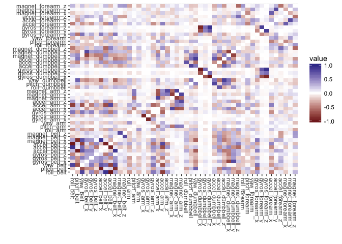
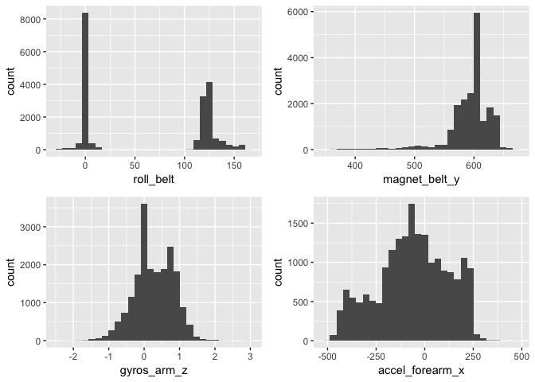
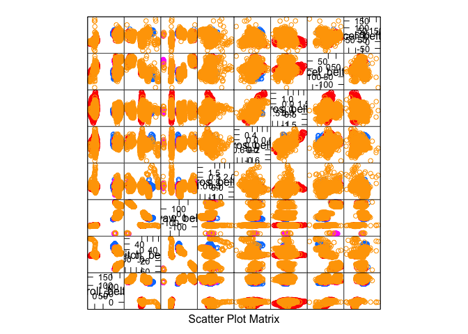
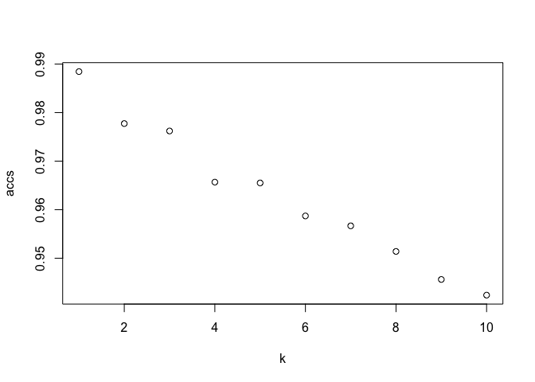

# Supervised Learning: Classification of Exercise
Sean Angiolillo  
14 December 2017  


## Introduction

In this investigation, we will try to classify the manner in which an exercise was done using accelerometer, gyroscope and magnetometer data. In an [experiment](http://groupware.les.inf.puc-rio.br/har), under expert supervision, six participants performed the same exercise (a bicep curl) in the correct fashion and four common mistakes.

These mistakes included throwing elbows to the front, lifting the dumbbell only halfway, lowering the dumbbell only halfway, and throwing the hips to the front. Data was collected from three instruments on the participant's belt, forearm, arm, and dumbbell.

Being able to classify the manner in which an exercise was completed, rather than just the quantity of exercises finished, would have a number of important applications related to exercise safety and performance.

The given task is really focused only on prediction, and so the tradeoffs we associate with achieving greater accuracy (reduced scalability, interpretability, speed or simplicity) can be ignored in favor of better predictions. 

It also does not seem like any kind of mistake is more damaging than another so we won't need to make a certain kind of mistake more costlier than others. That is, we can treat false negatives and false positives equally. Overall accuracy, rather than the sensitivity or specificity, will be our guiding metric.

## Data Preparation
### Data Loading


```r
# load libraries
library(caret)
library(plyr)
library(dplyr)
library(reshape2)
library(ggplot2)
library(gridExtra)
library(class)
library(gmodels)
library(naivebayes)
library(C50)
library(rpart)
library(randomForest)
```


First we need to read in the data. Note that I've called the provided testing set the validation set, as I'll have data sampled from the training set that I'll refer to as the testing data.


```r
# download and read in training if not present
if (!file.exists("training.csv")) {
    url <- "https://d396qusza40orc.cloudfront.net/predmachlearn/pml-training.csv"
    download.file(url, dest = "training.csv", mode = "wb") 
}

if (!exists("trainingRaw")) {
  trainingRaw <- read.csv("training.csv")
}

# download and read in testing if not present
if (!file.exists("testing.csv")) {
    url <- "https://d396qusza40orc.cloudfront.net/predmachlearn/pml-testing.csv"
    download.file(url, dest = "testing.csv", mode = "wb") 
}

if (!exists("testing")) {
  validation <- read.csv("testing.csv")
}
```

After reading in the data, we have an initial training set of 19622 rows and 160 columns, one of which is the outcome variable, `classe`, that we want to predict. Our validation set is only 20 observations.

### Handle Missing Data

Missing data is a problem for many of the machine learning algorithms we'd like to run to build our models, and one of the first things to notice when looking at this training set is the prevalence of missing data. Out of 19622 observations, we have only 406 complete cases.


```r
# instances of missing data in each column in training set
missingCols <- cbind(colSums(is.na(trainingRaw)))

# samples of complete and missing predictors
cbind(missingCols[1:5,])
```

```
##                      [,1]
## X                       0
## user_name               0
## raw_timestamp_part_1    0
## raw_timestamp_part_2    0
## cvtd_timestamp          0
```

```r
cbind(missingCols[27:32,])
```

```
##                       [,1]
## var_total_accel_belt 19216
## avg_roll_belt        19216
## stddev_roll_belt     19216
## var_roll_belt        19216
## avg_pitch_belt       19216
## stddev_pitch_belt    19216
```

Looking at the missing data column-wise, we can see that we have two types of columns with regard to missing data in the training set: 93 columns fully complete and 67 columns each missing 1.9216\times 10^{4} observations.

Rather than trying a strategy like median or k-nearest neighbors imputation on the missing data, it is important to realize that these columns actually represent summary statistics for the other columns, for instance, columns beginning with `avg`, `stddev` or `var`. These summary statistics correspond to the binary `new_window` variable, and so we can be confident in removing these columns (as well as `new_window`) from consideration in training and validation sets.

(As a side note, if we were interested in interpretability, it may be interesting to try to build a model only with the summary statistics.) 

Because we are tasked with making our predictions from only the measurements, I'll also remove the first few predictor variables including some of the time series data.


```r
# find summary predictors
sum_stats <- c("max","min","amplitude","avg","stddev","kurtosis",
               "skewness","total", "var")
drops <- unique(grep(paste(sum_stats, collapse = "|"),
                     names(trainingRaw), value = TRUE))

# find other unnecessary predictors
non_numeric_cols <- c("X", "user_name", "raw_timestamp_part_1",
           "raw_timestamp_part_2","cvtd_timestamp","new_window",
           "num_window")

# compete list of columns to be dropped
drops <- append(drops, non_numeric_cols)

# drop columns in training and validation sets
training <- trainingRaw[ , !(names(trainingRaw) %in% drops)]
validation <- validation[ , !(names(validation) %in% drops)]
```

### Checking Data Types

Now we have reduced the number of predictor variables from 159 to 159. The `str` function shows that some predictors are stored as numeric, while others are integer. I'll make them all numeric.


```r
# convert measurements to numeric variables
training[,1:48] <- lapply(training[,1:48], as.numeric)
validation[,1:48] <- lapply(validation[,1:48], as.numeric)
```

### Check for Near Zero Variance Predictors

After removing columns with missing data, we can check for predictor variables with zero or near zero variance because these would likely be poor predictors. It returns 0 rows so we have no concerns from this perspective.


```r
# calculate zero and near zero variance predictors
nearzero <- nearZeroVar(training, saveMetrics = TRUE)
nrow(nearzero[nearzero$nzv == TRUE,])
```

```
## [1] 0
```

### Check for Multicollinearity

We should also check our predictor variables for multicollinearity. We can do this with a correlation matrix.


```r
# create correlation matrix
cor.matrix <- cor(training[,-49])

# set correlations of variables with themselves to 0 
diag(cor.matrix) <- 0

# plot correlation matrix
ggplot(melt(cor.matrix), aes(x = Var1, y = Var2, fill = value)) +
    geom_tile() +
    scale_fill_gradient2(limits = c(-1, 1)) +
    theme(axis.text.x = element_text(angle=-90, vjust=0.5, hjust=0)) +
    labs(x = "", y = "")
```

<!-- -->

We can see the most highly correlated variables in a table.


```r
# find most highly correlated predictors
high_cors <- filter(arrange(melt(cor.matrix), -abs(value)), abs(value) > 0.8)
high_cors[-seq(0, nrow(high_cors), 2),]
```

```
##                Var1             Var2      value
## 1      accel_belt_z        roll_belt -0.9920085
## 3  gyros_dumbbell_z gyros_dumbbell_x -0.9789507
## 5      accel_belt_x       pitch_belt -0.9657334
## 7      accel_belt_z     accel_belt_y -0.9333854
## 9   gyros_forearm_z gyros_dumbbell_z  0.9330422
## 11     accel_belt_y        roll_belt  0.9248983
## 13      gyros_arm_y      gyros_arm_x -0.9181821
## 15  gyros_forearm_z gyros_dumbbell_x -0.9144764
## 17    magnet_belt_x     accel_belt_x  0.8920913
## 19    magnet_belt_x       pitch_belt -0.8841727
## 21 accel_dumbbell_z     yaw_dumbbell  0.8491322
## 23  gyros_forearm_z  gyros_forearm_y  0.8455626
## 25         yaw_belt        roll_belt  0.8152297
## 27     magnet_arm_z     magnet_arm_y  0.8144455
## 29     magnet_arm_x      accel_arm_x  0.8142732
## 31 accel_dumbbell_x   pitch_dumbbell  0.8082885
```

Some variables do appear to be highly correlated. We have 16 pairs of variables with a correlation above 0.8.

Because our goal is only prediction, as opposed to interpretation, there is not too much to gain by trying to remove further variables from our model. Without a better understanding of the underlying physics, the reasons for these correlations are not immediately apparent.

### Predictor Summary

To summarize our 48 predictors, we have three instruments (accelerometer, gyroscope and magnetometer) taking measurements in four places (belt, arm, forearm, and dumbbell) plus the roll, pitch and yaw measurements for each.


```r
# predictor variables
names(training[,1:48])
```

```
##  [1] "roll_belt"         "pitch_belt"        "yaw_belt"         
##  [4] "gyros_belt_x"      "gyros_belt_y"      "gyros_belt_z"     
##  [7] "accel_belt_x"      "accel_belt_y"      "accel_belt_z"     
## [10] "magnet_belt_x"     "magnet_belt_y"     "magnet_belt_z"    
## [13] "roll_arm"          "pitch_arm"         "yaw_arm"          
## [16] "gyros_arm_x"       "gyros_arm_y"       "gyros_arm_z"      
## [19] "accel_arm_x"       "accel_arm_y"       "accel_arm_z"      
## [22] "magnet_arm_x"      "magnet_arm_y"      "magnet_arm_z"     
## [25] "roll_dumbbell"     "pitch_dumbbell"    "yaw_dumbbell"     
## [28] "gyros_dumbbell_x"  "gyros_dumbbell_y"  "gyros_dumbbell_z" 
## [31] "accel_dumbbell_x"  "accel_dumbbell_y"  "accel_dumbbell_z" 
## [34] "magnet_dumbbell_x" "magnet_dumbbell_y" "magnet_dumbbell_z"
## [37] "roll_forearm"      "pitch_forearm"     "yaw_forearm"      
## [40] "gyros_forearm_x"   "gyros_forearm_y"   "gyros_forearm_z"  
## [43] "accel_forearm_x"   "accel_forearm_y"   "accel_forearm_z"  
## [46] "magnet_forearm_x"  "magnet_forearm_y"  "magnet_forearm_z"
```

I won't plot all of them here, but we get a wide range of distributions. Few if any could be considered approximately normal.


```r
# a few distributions of predictor variables
p1 <- ggplot(training, aes(x = roll_belt)) + geom_histogram()
p2 <- ggplot(training, aes(x = magnet_belt_y)) + geom_histogram()
p3 <- ggplot(training, aes(x = gyros_arm_z)) + geom_histogram()
p4 <- ggplot(training, aes(x = accel_forearm_x)) + geom_histogram()
grid.arrange(p1, p2, p3, p4, ncol = 2)
```

<!-- -->

Lastly, I want to check for unbalanced outcomes in the data. Having vastly more than one type of class than another will impact how we interpret the accuracy of our results. While class A is more common than the others, it does not appear different enough to affect our models in a dataset of this size.


```r
# distribution of classe outcome
round(prop.table(table(training$classe)),4)
```

```
## 
##      A      B      C      D      E 
## 0.2844 0.1935 0.1744 0.1639 0.1838
```

It is a bit difficult to visualize all of the data. We could make a series of scatterplot matrices like the one below, but it's not unreasonable to expect non-linear models to perform better in this task.


```r
# scatterplot matrix for first 8 predictors
featurePlot(x = training[,1:8], y = training$classe, plot = "pairs")
```

<!-- -->

### Data Slicing

Having explored the data and selected our feature variables, the next step would be to extract a hold out set from the training data before building models. I've done a 70/30 split here.


```r
set.seed(417)
# 70/30 split of training data
intrain <- createDataPartition(y = training$classe, p = 0.7, 
                               list = FALSE)
train <- training[intrain,]
test <- training[-intrain,]

# confirm dimensions
dim(train); dim(test)
```

```
## [1] 13737    49
```

```
## [1] 5885   49
```

Because we randomly sampled from a large dataset, the structure of the problem remains the same in the training and test set.


```r
# distribution of classe outcome in training, train and test sets
round(prop.table(table(training$classe)),4)
```

```
## 
##      A      B      C      D      E 
## 0.2844 0.1935 0.1744 0.1639 0.1838
```

```r
round(prop.table(table(train$classe)),4)
```

```
## 
##      A      B      C      D      E 
## 0.2843 0.1935 0.1744 0.1639 0.1838
```

```r
round(prop.table(table(test$classe)),4)
```

```
## 
##      A      B      C      D      E 
## 0.2845 0.1935 0.1743 0.1638 0.1839
```

## Model Exploration

Having explored and prepared the dataset, I can now experiment with a number of different algorithms to build a successful prediction model.

### K-Nearest Neighbors

I suspect the relationships among our predictors and the classes is complicated but when taken together, I imagine the classes to be fairly homogenous. Accordingly, the first algorithm I'll try to use is k-nearest neighbors because it is a simple and widely used algorithm for classification. Because we have no desire to generate an underlying theory about the data, a non-parametric model like k-nearest neighbors is appropriate.

After standardizing the data, the challenge in applying this algorithm will be in choosing k. I'll start from 1 and compare it to results with larger instances of k.


```r
# standardize data
train_z <- as.data.frame(scale(train[-49]))
test_z <- as.data.frame(scale(test[-49]))

set.seed(417)

#define range for k values and initializes accs
range <- 1:10
accs <- rep(0, length(range))

for (k in range) {
  # make predictions using knn
  pred <- knn(train_z, test_z, train[,49], k = k)

  # construct the confusion matrix
  conf <- table(test[,49], pred)

  # calculate and store the accuracy
  accs[k] <- mean(pred == test[,49])
}

# Plot the accuracies
plot(range, accs, xlab = "k")
```

<!-- -->

Although we only tried a maximum k of 10, it seems a clear decrease in accuracy as k increases. Below is the confusion matrix for our most accurate result.


```r
# confusion matrix when k = 1
pred.knn <- knn(train = train_z, test = test_z,
                      cl = train[,49], 
                      k = 1)

# Create the cross tabulation of predicted vs. actual
CrossTable(x = test[,49], y = pred.knn,
           prop.chisq = FALSE)
```

```
## 
##  
##    Cell Contents
## |-------------------------|
## |                       N |
## |           N / Row Total |
## |           N / Col Total |
## |         N / Table Total |
## |-------------------------|
## 
##  
## Total Observations in Table:  5885 
## 
##  
##              | pred.knn 
##   test[, 49] |         A |         B |         C |         D |         E | Row Total | 
## -------------|-----------|-----------|-----------|-----------|-----------|-----------|
##            A |      1666 |         7 |         1 |         0 |         0 |      1674 | 
##              |     0.995 |     0.004 |     0.001 |     0.000 |     0.000 |     0.284 | 
##              |     0.995 |     0.006 |     0.001 |     0.000 |     0.000 |           | 
##              |     0.283 |     0.001 |     0.000 |     0.000 |     0.000 |           | 
## -------------|-----------|-----------|-----------|-----------|-----------|-----------|
##            B |         8 |      1121 |         9 |         0 |         1 |      1139 | 
##              |     0.007 |     0.984 |     0.008 |     0.000 |     0.001 |     0.194 | 
##              |     0.005 |     0.986 |     0.009 |     0.000 |     0.001 |           | 
##              |     0.001 |     0.190 |     0.002 |     0.000 |     0.000 |           | 
## -------------|-----------|-----------|-----------|-----------|-----------|-----------|
##            C |         0 |         7 |      1008 |        10 |         1 |      1026 | 
##              |     0.000 |     0.007 |     0.982 |     0.010 |     0.001 |     0.174 | 
##              |     0.000 |     0.006 |     0.972 |     0.010 |     0.001 |           | 
##              |     0.000 |     0.001 |     0.171 |     0.002 |     0.000 |           | 
## -------------|-----------|-----------|-----------|-----------|-----------|-----------|
##            D |         0 |         0 |        14 |       949 |         1 |       964 | 
##              |     0.000 |     0.000 |     0.015 |     0.984 |     0.001 |     0.164 | 
##              |     0.000 |     0.000 |     0.014 |     0.988 |     0.001 |           | 
##              |     0.000 |     0.000 |     0.002 |     0.161 |     0.000 |           | 
## -------------|-----------|-----------|-----------|-----------|-----------|-----------|
##            E |         0 |         2 |         5 |         2 |      1073 |      1082 | 
##              |     0.000 |     0.002 |     0.005 |     0.002 |     0.992 |     0.184 | 
##              |     0.000 |     0.002 |     0.005 |     0.002 |     0.997 |           | 
##              |     0.000 |     0.000 |     0.001 |     0.000 |     0.182 |           | 
## -------------|-----------|-----------|-----------|-----------|-----------|-----------|
## Column Total |      1674 |      1137 |      1037 |       961 |      1076 |      5885 | 
##              |     0.284 |     0.193 |     0.176 |     0.163 |     0.183 |           | 
## -------------|-----------|-----------|-----------|-----------|-----------|-----------|
## 
## 
```

This amounts to an accuracy of 98.84%. This is pretty good, but because we took only one test sample (i.e. we did not do any cross-validation), we may be susceptible to overfitting.

Because cross-validation is easiest to implement with `caret`, I'll build the model there. It can also normalize the data for us. In creating a `train` object, we'll also get a lot of other useful information about the model's performance.


```r
# 10 fold cv
ctrl <- trainControl(method = "repeatedcv", number = 10)

set.seed(417)
# fit a knn model with caret
fit.knn.cv <- train(classe ~., data = train, method = "knn",
                 trControl = ctrl,
                 preProcess = c("center", "scale"),
                 tuneLength = 5)
# generate predictions
pred.knn.cv <- predict(fit.knn.cv, newdata = test)

# create a confusion matrix
confusionMatrix(pred.knn.cv, test$classe)
```

```
## Confusion Matrix and Statistics
## 
##           Reference
## Prediction    A    B    C    D    E
##          A 1647   30    1    5    1
##          B   10 1074   11    0   11
##          C    6   30  984   54    7
##          D    7    2   18  902    6
##          E    4    3   12    3 1057
## 
## Overall Statistics
##                                           
##                Accuracy : 0.9624          
##                  95% CI : (0.9573, 0.9672)
##     No Information Rate : 0.2845          
##     P-Value [Acc > NIR] : < 2.2e-16       
##                                           
##                   Kappa : 0.9525          
##  Mcnemar's Test P-Value : 1.475e-07       
## 
## Statistics by Class:
## 
##                      Class: A Class: B Class: C Class: D Class: E
## Sensitivity            0.9839   0.9429   0.9591   0.9357   0.9769
## Specificity            0.9912   0.9933   0.9800   0.9933   0.9954
## Pos Pred Value         0.9780   0.9711   0.9103   0.9647   0.9796
## Neg Pred Value         0.9936   0.9864   0.9913   0.9875   0.9948
## Prevalence             0.2845   0.1935   0.1743   0.1638   0.1839
## Detection Rate         0.2799   0.1825   0.1672   0.1533   0.1796
## Detection Prevalence   0.2862   0.1879   0.1837   0.1589   0.1833
## Balanced Accuracy      0.9875   0.9681   0.9696   0.9645   0.9862
```

In terms of accuracy, this model did very well but not as well as the previous attempt without cross-validation. Still, this would likely be a more accurate out of sample error estimate. However, if we examine the model object, we see that caret started with k = 5 and increased from there, and so it didn't try k = 1. I couldn't yet figure out how to specify caret to try that!

### Naive Bayes

Naive Bayes is another popular algorithm for classification tasks that attempts to calculate probabilities for each outcome based on the evidence in the predictors.


```r
set.seed(417)
# fit a naive bayes model and generate predictions
fit.nb <- naive_bayes(classe ~ ., data = train)
pred.nb <- predict(fit.nb, newdata = test, type = "class")

# Create the cross tabulation of predicted vs. actual
CrossTable(x = test[,49], y = pred.nb,
           prop.chisq = FALSE)
```

```
## 
##  
##    Cell Contents
## |-------------------------|
## |                       N |
## |           N / Row Total |
## |           N / Col Total |
## |         N / Table Total |
## |-------------------------|
## 
##  
## Total Observations in Table:  5885 
## 
##  
##              | pred.nb 
##   test[, 49] |         A |         B |         C |         D |         E | Row Total | 
## -------------|-----------|-----------|-----------|-----------|-----------|-----------|
##            A |       413 |       160 |       833 |       209 |        59 |      1674 | 
##              |     0.247 |     0.096 |     0.498 |     0.125 |     0.035 |     0.284 | 
##              |     0.859 |     0.127 |     0.360 |     0.217 |     0.068 |           | 
##              |     0.070 |     0.027 |     0.142 |     0.036 |     0.010 |           | 
## -------------|-----------|-----------|-----------|-----------|-----------|-----------|
##            B |        44 |       724 |       237 |        63 |        71 |      1139 | 
##              |     0.039 |     0.636 |     0.208 |     0.055 |     0.062 |     0.194 | 
##              |     0.091 |     0.573 |     0.103 |     0.065 |     0.082 |           | 
##              |     0.007 |     0.123 |     0.040 |     0.011 |     0.012 |           | 
## -------------|-----------|-----------|-----------|-----------|-----------|-----------|
##            C |        11 |       123 |       743 |        89 |        60 |      1026 | 
##              |     0.011 |     0.120 |     0.724 |     0.087 |     0.058 |     0.174 | 
##              |     0.023 |     0.097 |     0.322 |     0.092 |     0.069 |           | 
##              |     0.002 |     0.021 |     0.126 |     0.015 |     0.010 |           | 
## -------------|-----------|-----------|-----------|-----------|-----------|-----------|
##            D |         0 |        53 |       345 |       454 |       112 |       964 | 
##              |     0.000 |     0.055 |     0.358 |     0.471 |     0.116 |     0.164 | 
##              |     0.000 |     0.042 |     0.149 |     0.471 |     0.129 |           | 
##              |     0.000 |     0.009 |     0.059 |     0.077 |     0.019 |           | 
## -------------|-----------|-----------|-----------|-----------|-----------|-----------|
##            E |        13 |       203 |       153 |       148 |       565 |      1082 | 
##              |     0.012 |     0.188 |     0.141 |     0.137 |     0.522 |     0.184 | 
##              |     0.027 |     0.161 |     0.066 |     0.154 |     0.652 |           | 
##              |     0.002 |     0.034 |     0.026 |     0.025 |     0.096 |           | 
## -------------|-----------|-----------|-----------|-----------|-----------|-----------|
## Column Total |       481 |      1263 |      2311 |       963 |       867 |      5885 | 
##              |     0.082 |     0.215 |     0.393 |     0.164 |     0.147 |           | 
## -------------|-----------|-----------|-----------|-----------|-----------|-----------|
## 
## 
```

Although still better than random guessing, we see that this model did very poorly. It has an accuracy of only 49.26%. I'm sure we could improve results with some better adjustments (and cross-validation), but given that our previous model resulted in 98% accuracy with little work, this seems like the wrong algorithm for this problem.

### Decision Trees (rpart)

Decision trees are another powerful classifier that are often a good option when interpretability is a priority. They use recursive partitioning to divide the dataset into likely outcomes. I'll first use the `rpart` package.


```r
set.seed(417)
# Grow a tree
fit.rpart <- rpart(classe ~ ., data = train, method = "class")

# Make predictions on the test dataset
pred.rpart <- predict(fit.rpart, test, type = "class")

# Examine the confusion matrix
table(test$classe, pred.rpart)
```

```
##    pred.rpart
##        A    B    C    D    E
##   A 1456   43   39   68   68
##   B  236  700   95   56   52
##   C   47  113  702  143   21
##   D   45   79  101  678   61
##   E   72  150   60  113  687
```

```r
# Compute the accuracy on the test dataset
mean(test$classe == pred.rpart)
```

```
## [1] 0.7175871
```

This model performed poorer than our previous efforts. Let's add cross validation by fitting the model in caret. 


```r
# Run algorithms using 5-fold cross validation
ctrl <- trainControl(method="cv", number = 10)

# fit the model
fit.rpart.caret <- train(classe ~ ., data = train, method = "rpart",
                         trControl = ctrl)

# Make predictions on the test dataset
pred.rpart.caret <- predict(fit.rpart.caret, test)

# Examine the confusion matrix
table(test$classe, pred.rpart.caret)
```

```
##    pred.rpart.caret
##       A   B   C   D   E
##   A 975 268 387  19  25
##   B 177 712 237  13   0
##   C  26  97 881  22   0
##   D  51 315 344 254   0
##   E  12 297 241  17 515
```

```r
# Compute the accuracy on the test dataset
mean(test$classe == pred.rpart.caret)
```

```
## [1] 0.5670348
```

### Decision Trees (C5.0)

Next, I'll try to build a decision tree using the C5.0 algorithm, which is another version of a classification tree.


```r
set.seed(417)
fit.C5 <- C5.0(classe ~ ., data = train, trials = 1, costs = NULL)

# Make predictions on the test dataset
pred.C5 <- predict(fit.C5, test, type = "class")

# Examine the confusion matrix
table(test$classe, pred.C5)
```

```
##    pred.C5
##        A    B    C    D    E
##   A 1639   15    9    6    5
##   B   24 1070   30    9    6
##   C    3   16  986   17    4
##   D    8   12   23  916    5
##   E    1    4    8   14 1055
```

```r
# Compute the accuracy on the test dataset
mean(test$classe == pred.C5)
```

```
## [1] 0.9627867
```

I anticipated the C5.0 algorithm to be very similar to our `rpart` result, but this does much better.

To get this level of accuracy, our tree went 353 decisions deep. In this case, we are not too concerned with interpretability, but we would want to do considerable pruning if that were the case. As we've done before, I'll fit the model in caret using cross validation.


```r
# Run algorithms using 10-fold cross validation
ctrl <- trainControl(method="cv", number = 10)

set.seed(417)
# fit the model
fit.C50.caret <- train(classe ~ ., data = train, method = "C5.0",
                         trControl = ctrl)

# Make predictions on the test dataset
pred.C50.caret <- predict(fit.C50.caret, test)

# Examine the confusion matrix
table(test$classe, pred.C50.caret)
```

```
##    pred.C50.caret
##        A    B    C    D    E
##   A 1673    1    0    0    0
##   B    6 1131    0    2    0
##   C    0    2 1023    1    0
##   D    0    0    2  959    3
##   E    0    1    0    0 1081
```

```r
# Compute the accuracy on the test dataset
mean(test$classe == pred.C50.caret)
```

```
## [1] 0.9969414
```

Our accuracy has increased even higher.

### Boosted Decision Tree

A simple modification of the C.50 decision tree model is to do repeated trials, which can be considered a form of boosting. While it will take longer to run, it should produce more accurate results. Particularly since we didn't use cross validation here, running 10 trials is a good idea to get a better estimate of out of sample error.


```r
set.seed(417)
# fit a boosted decision tree
fit.C5b <- C5.0(classe ~ ., data = train, trials = 10)

# Make predictions on the test dataset
pred.C5b <- predict(fit.C5b, test, type = "class")

# Examine the confusion matrix
table(test$classe, pred.C5b)
```

```
##    pred.C5b
##        A    B    C    D    E
##   A 1673    0    0    1    0
##   B    8 1126    3    2    0
##   C    0    2 1020    4    0
##   D    0    0   10  952    2
##   E    1    2    1    0 1078
```

```r
# Compute the accuracy on the test dataset
mean(test$classe == pred.C5b)
```

```
## [1] 0.9938828
```

Across these 10 iterations, our average tree size shrunk to 233.6, and the accuracy was very high.

### Random Forest

Now that we have done a few decision tree models, we can try a random forest, where the idea is to build a number of trees (a forest) and use a vote to combine the predictions from the trees. This would be a form of ensembling, and often yields very accurate predictions while being robust to overfitting.


```r
set.seed(417)
# Grow a tree
fit.rf <- randomForest(classe ~ ., data = train, method = "class")

# Make predictions on the test dataset
pred.rf <- predict(fit.rf, test, type = "class")

# Examine the confusion matrix
table(pred.rf, test$classe)
```

```
##        
## pred.rf    A    B    C    D    E
##       A 1673    2    0    0    0
##       B    0 1136    3    0    0
##       C    0    1 1022    7    1
##       D    0    0    1  957    2
##       E    1    0    0    0 1079
```

```r
# Compute the accuracy on the test dataset
mean(pred.rf == test$classe)
```

```
## [1] 0.9969414
```

Alternatively we could build this in caret, where we can more easily include cross-validation.


```r
ctrl <- trainControl(method = "cv", 10)
set.seed(417)
# fit the model
fit.rf.caret <- train(classe ~ ., data = train, method = "rf",
                trControl = ctrl, ntree = 250)

# Make predictions on the test dataset
pred.rf.caret <- predict(fit.rf.caret, test)

# Examine the confusion matrix
confusionMatrix(pred.rf.caret, test$classe)
```

```
## Confusion Matrix and Statistics
## 
##           Reference
## Prediction    A    B    C    D    E
##          A 1672    3    0    0    0
##          B    1 1135    1    1    1
##          C    0    1 1023    7    3
##          D    0    0    2  956    3
##          E    1    0    0    0 1075
## 
## Overall Statistics
##                                           
##                Accuracy : 0.9959          
##                  95% CI : (0.9939, 0.9974)
##     No Information Rate : 0.2845          
##     P-Value [Acc > NIR] : < 2.2e-16       
##                                           
##                   Kappa : 0.9948          
##  Mcnemar's Test P-Value : NA              
## 
## Statistics by Class:
## 
##                      Class: A Class: B Class: C Class: D Class: E
## Sensitivity            0.9988   0.9965   0.9971   0.9917   0.9935
## Specificity            0.9993   0.9992   0.9977   0.9990   0.9998
## Pos Pred Value         0.9982   0.9965   0.9894   0.9948   0.9991
## Neg Pred Value         0.9995   0.9992   0.9994   0.9984   0.9985
## Prevalence             0.2845   0.1935   0.1743   0.1638   0.1839
## Detection Rate         0.2841   0.1929   0.1738   0.1624   0.1827
## Detection Prevalence   0.2846   0.1935   0.1757   0.1633   0.1828
## Balanced Accuracy      0.9990   0.9978   0.9974   0.9953   0.9967
```

## Random Forest (Ranger)

Just for demonstration we could specify `ranger` instead of `rf` as it is designed to be a faster implementation with similar results.


```r
ctrl <- trainControl(method = "cv", 10, verboseIter = FALSE)
set.seed(417)
# Fit random forest with ranger
fit.ranger <- train(classe ~ ., data = train, 
                    method = "ranger", 
                    trControl = ctrl)
```

```
## Growing trees.. Progress: 65%. Estimated remaining time: 16 seconds.
## Growing trees.. Progress: 87%. Estimated remaining time: 4 seconds.
## Growing trees.. Progress: 67%. Estimated remaining time: 15 seconds.
## Growing trees.. Progress: 80%. Estimated remaining time: 7 seconds.
## Growing trees.. Progress: 53%. Estimated remaining time: 27 seconds.
## Growing trees.. Progress: 98%. Estimated remaining time: 1 seconds.
## Growing trees.. Progress: 76%. Estimated remaining time: 10 seconds.
## Growing trees.. Progress: 55%. Estimated remaining time: 25 seconds.
## Growing trees.. Progress: 83%. Estimated remaining time: 6 seconds.
## Growing trees.. Progress: 61%. Estimated remaining time: 19 seconds.
## Growing trees.. Progress: 80%. Estimated remaining time: 7 seconds.
## Growing trees.. Progress: 65%. Estimated remaining time: 16 seconds.
## Growing trees.. Progress: 88%. Estimated remaining time: 4 seconds.
## Growing trees.. Progress: 98%. Estimated remaining time: 0 seconds.
## Growing trees.. Progress: 52%. Estimated remaining time: 29 seconds.
## Growing trees.. Progress: 63%. Estimated remaining time: 18 seconds.
## Growing trees.. Progress: 99%. Estimated remaining time: 0 seconds.
## Growing trees.. Progress: 55%. Estimated remaining time: 25 seconds.
## Growing trees.. Progress: 79%. Estimated remaining time: 8 seconds.
## Growing trees.. Progress: 62%. Estimated remaining time: 18 seconds.
## Growing trees.. Progress: 81%. Estimated remaining time: 7 seconds.
## Growing trees.. Progress: 56%. Estimated remaining time: 23 seconds.
## Growing trees.. Progress: 89%. Estimated remaining time: 3 seconds.
## Growing trees.. Progress: 67%. Estimated remaining time: 15 seconds.
```

```r
pred.ranger <- predict(fit.ranger, test)

confusionMatrix(pred.ranger, test$classe)
```

```
## Confusion Matrix and Statistics
## 
##           Reference
## Prediction    A    B    C    D    E
##          A 1673    1    0    0    0
##          B    0 1137    4    0    0
##          C    0    1 1022    7    0
##          D    0    0    0  957    1
##          E    1    0    0    0 1081
## 
## Overall Statistics
##                                           
##                Accuracy : 0.9975          
##                  95% CI : (0.9958, 0.9986)
##     No Information Rate : 0.2845          
##     P-Value [Acc > NIR] : < 2.2e-16       
##                                           
##                   Kappa : 0.9968          
##  Mcnemar's Test P-Value : NA              
## 
## Statistics by Class:
## 
##                      Class: A Class: B Class: C Class: D Class: E
## Sensitivity            0.9994   0.9982   0.9961   0.9927   0.9991
## Specificity            0.9998   0.9992   0.9984   0.9998   0.9998
## Pos Pred Value         0.9994   0.9965   0.9922   0.9990   0.9991
## Neg Pred Value         0.9998   0.9996   0.9992   0.9986   0.9998
## Prevalence             0.2845   0.1935   0.1743   0.1638   0.1839
## Detection Rate         0.2843   0.1932   0.1737   0.1626   0.1837
## Detection Prevalence   0.2845   0.1939   0.1750   0.1628   0.1839
## Balanced Accuracy      0.9996   0.9987   0.9972   0.9963   0.9994
```

### Stacked Model

The winner of the Netflix prize was one indication that ensembling models can lead to very good predictions. And since scalability is not a concern to us, let's try to stack some of our previous models together and vote on their combined predictions.


```r
# combine predictions of the best models into one df
pred.df <- data.frame(pred.knn.cv, 
                     pred.C5, pred.rf, classe = test$classe)

set.seed(417)
# train a model using combined df
fit.comb <- train(classe ~ . , method = "ranger", data = pred.df)

# generate predictions
pred.comb <- predict(fit.comb, pred.df)

# create a confusion matrix
confusionMatrix(pred.comb, test$classe)
```

```
## Confusion Matrix and Statistics
## 
##           Reference
## Prediction    A    B    C    D    E
##          A 1672    2    0    0    0
##          B    0 1136    3    0    0
##          C    0    1 1022    7    0
##          D    0    0    1  957    0
##          E    2    0    0    0 1082
## 
## Overall Statistics
##                                           
##                Accuracy : 0.9973          
##                  95% CI : (0.9956, 0.9984)
##     No Information Rate : 0.2845          
##     P-Value [Acc > NIR] : < 2.2e-16       
##                                           
##                   Kappa : 0.9966          
##  Mcnemar's Test P-Value : NA              
## 
## Statistics by Class:
## 
##                      Class: A Class: B Class: C Class: D Class: E
## Sensitivity            0.9988   0.9974   0.9961   0.9927   1.0000
## Specificity            0.9995   0.9994   0.9984   0.9998   0.9996
## Pos Pred Value         0.9988   0.9974   0.9922   0.9990   0.9982
## Neg Pred Value         0.9995   0.9994   0.9992   0.9986   1.0000
## Prevalence             0.2845   0.1935   0.1743   0.1638   0.1839
## Detection Rate         0.2841   0.1930   0.1737   0.1626   0.1839
## Detection Prevalence   0.2845   0.1935   0.1750   0.1628   0.1842
## Balanced Accuracy      0.9992   0.9984   0.9972   0.9963   0.9998
```

Although it wasn't entirely necessary given our previous levels of accuracy, this approach also yielded very accurate predictions.

## Predictions on Final Validation Set

We have a number of models to potentially choose from in order to apply to the validation set. After successfully completing the exercise with the random forest model, I saved the correct answers into a vector in order to test some of our best models and see the results. Our random forest models and C5.0 decision trees correctly predicted all 20 observations in the validation set.


```r
# correct answers from the quiz
answers <- data.frame(question = 1:20,
                      pred = c("B","A","B","A","A","E","D","B","A", 
                               "A","B","C", "B","A","E","E","A", 
                               "B","B","B"))

# compare predictions on validation set with correct answers
identical(predict(fit.C5b, validation, type = "class"), answers$pred)
```

```
## [1] TRUE
```

```r
identical(predict(fit.C5, validation, type = "class"), answers$pred)
```

```
## [1] TRUE
```

```r
identical(predict(fit.C50.caret, validation), answers$pred)
```

```
## [1] TRUE
```

```r
identical(predict(fit.ranger, validation), answers$pred)
```

```
## [1] TRUE
```

```r
identical(predict(fit.rf.caret, validation), answers$pred)
```

```
## [1] TRUE
```
